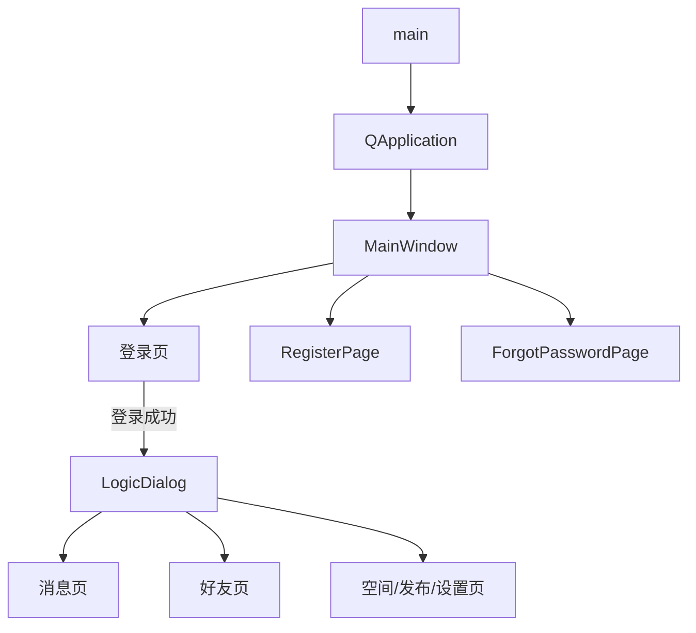
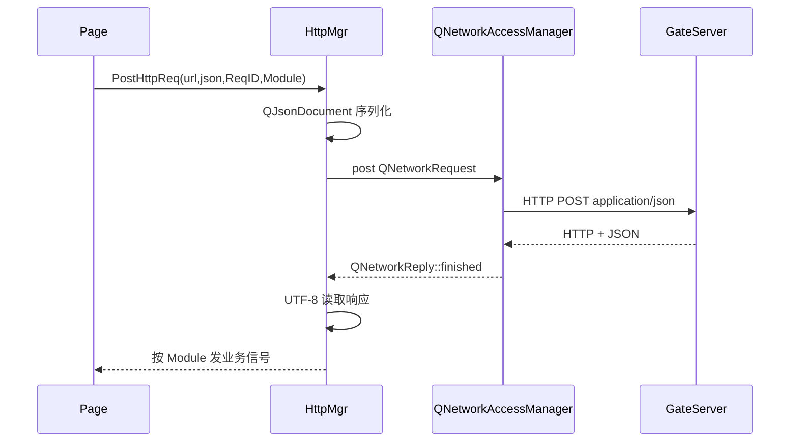
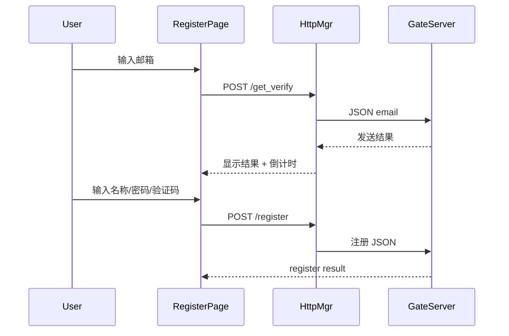
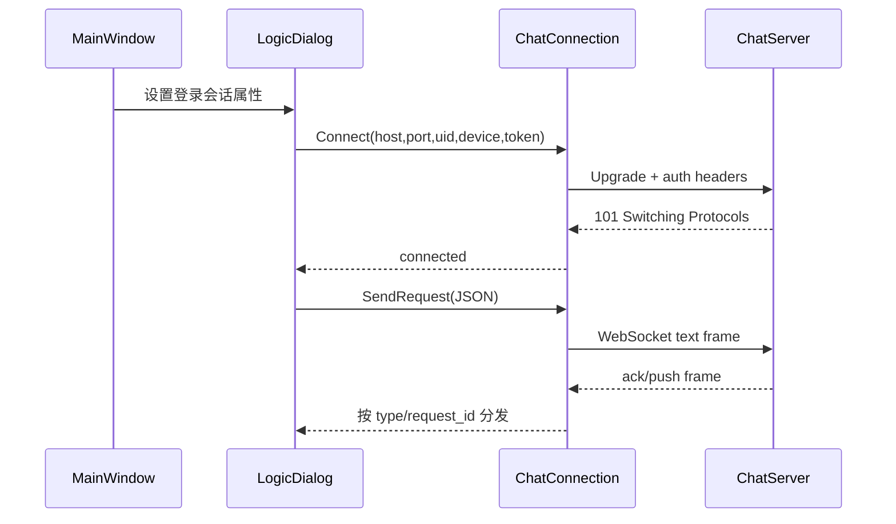
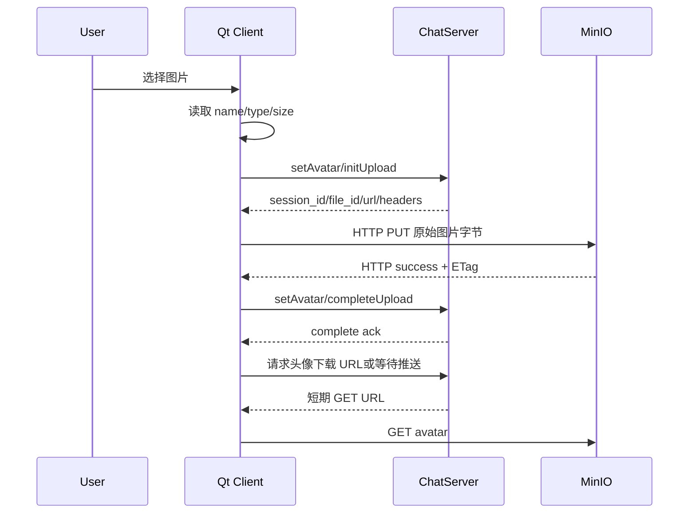

# Qt Client 架构与流程说明

> 源码快照：2026-09-02
> 模块目录：`client`
> 当前定位：Qt 6 桌面客户端，已完成账号 HTTP 流程和主要 UI，WebSocket/文件客户端尚未接入。

项目级调用关系参见：[项目整体架构、服务流程与存储总览](../docs/项目整体架构、服务流程与存储总览.md)。

## 1. 职责边界

Qt Client 负责：

- 登录、注册、找回密码和聊天主界面；
- 读取 GateServer 地址；
- 构造 HTTP JSON 请求；
- 保存客户端设备 ID；
- 登录成功后保存 ChatServer 地址和凭证；
- 后续建立 WebSocket；
- 后续直接使用预签名 URL向 MinIO 上传/下载文件。

客户端不能决定：

- 可信 `uid`；
- ChatServer 分配结果；
- 文件 `uploader_id`；
- MinIO 对象键；
- 上传完成状态。

## 2. 主要文件

```text
client/
├─ main.cpp
├─ mainwindow.cpp/.h/.ui
├─ registerpage.cpp/.h/.ui
├─ forgotpasswordpage.cpp/.h
├─ logicdialog.cpp/.h/.ui
├─ httpmgr.cpp/.h
├─ const.h
├─ singleton.h
├─ config.ini.example
├─ CMakeLists.txt
├─ assets/
└─ resources.qrc
```

## 3. 启动与页面关系



当前 `LogicDialog` 中不少功能是 UI 原型，并未连接真实后端。

## 4. GateServer 配置

`const.h` 中的 `gateServerUrl()` 使用：

```text
QCoreApplication::applicationDirPath()/config.ini
```

配置：

```ini
[GateServer]
host=127.0.0.1
port=9999
```

如果找不到配置，当前代码回退：

```text
host = localhost
port = 9999
```

CMake 会尝试把源码目录中的 `config.ini` 复制到输出目录；实际密钥或环境地址不能写入 `config.ini.example`。

## 5. HttpMgr

HTTP 请求流程：



特点：

- 使用 `QNetworkAccessManager` 异步请求；
- 设置 Content-Type 和 Content-Length；
- HTTP 4xx/5xx 如果有 JSON 响应体，仍交给业务层解析；
- `ReqID` 用于在页面内分发响应；
- `Modules` 区分登录模块和其他页面。

当前接口：

| ReqID | HTTP | 用途 |
|---|---|---|
| `ID_GET_VARIFY_CODE` | `/get_verify` | 注册验证码 |
| `ID_REG_USER` | `/register` | 注册 |
| `ID_LOGIN_USER` | `/login` | 登录 |
| `ID_GET_RESET_CODE` | `/get_verify` | 找回密码验证码 |
| `ID_RESET_PASSWORD` | 计划重置接口 | 后端尚未实现 |

## 6. 注册流程



注册成功后页面发出 `registerRequested`，MainWindow 可以切回登录页并填充账号信息。

## 7. 登录和设备 ID

登录请求：

```json
{
  "email": "user@example.com",
  "password": "...",
  "device_id": "10001"
}
```

`device_id` 以十进制字符串发送，避免 JSON Number 精度损失。

客户端通过 `QSettings` 持久化设备标识。它用于区分同一用户的多个设备，但不是认证凭证。

登录响应解析字段：

```text
email/user
uid
device_id
token
server_id
host/ip
port number/string
```

客户端兼容旧字段名和端口两种 JSON 类型，但新协议应保持统一。

## 8. 登录成功后的当前行为

成功后创建 `LogicDialog`，并保存动态属性：

```text
loginEmail
loginUid
loginDeviceId
loginToken
chatServerId
chatHost
chatPort
```

这些属性只是连接参数容器。当前没有代码根据它们建立 WebSocket。

正确的下一阶段结构应增加独立网络对象，例如：

```text
ChatConnection/ChatClient
  -> 建立 ws://host:port
  -> 设置 Authorization/X-User-Id/X-Device-Id
  -> 维护连接状态
  -> JSON 请求和响应分发
  -> 心跳和重连
```

不要把全部 WebSocket 逻辑继续堆进 `LogicDialog`。

## 9. WebSocket 目标流程



需要维护的状态：

- Disconnected；
- Connecting；
- Authenticating；
- Connected；
- Reconnecting；
- Closing。

## 10. 聊天 UI 当前状态

`LogicDialog::sendCurrentMessage()` 当前：

1. 读取输入框；
2. 在本地添加发送气泡；
3. 清空输入框。

它没有调用网络层。UI 中“发送中”也不会变成“已送达/失败”。

后续发送文本消息至少需要：

```json
{
  "version": 1,
  "require": "soloChat",
  "request_id": "request-uuid",
  "data": {
    "conversation_id": "...",
    "client_message_id": "uuid",
    "message_type": 0,
    "payload": {
      "text": "你好"
    }
  }
}
```

UI 应按 `client_message_id` 更新消息状态，而不是按文本内容查找气泡。

## 11. 头像上传目标流程



上传必须：

- 使用服务端返回的完整 URL，不能手工修改对象键；
- 携带 `upload_headers` 中要求的 Header；
- PUT Body 使用文件原始二进制，不是 JSON；
- 只有 MinIO PUT 成功后才发送 Complete；
- MySQL 和 UI 保存稳定 `file_id`，不保存预签名 URL。

## 12. 当前完成度

| 能力 | 状态 |
|---|---|
| Qt UI 框架 | 已实现 |
| 注册验证码 HTTP | 已实现 |
| 注册 HTTP | 已实现 |
| 登录 HTTP | 已实现 |
| device_id 持久化 | 已实现 |
| 登录响应解析 | 已实现 |
| 找回密码 UI | 部分实现 |
| WebSocket 客户端 | 未实现 |
| 真实消息发送 | 未实现 |
| 头像 InitUpload | 未实现于 Qt |
| MinIO PUT | 未实现于 Qt |
| CompleteUpload | 未实现于 Qt/后端 |

## 13. 下一步顺序

后端 CompleteUpload 闭环后，客户端按以下顺序开发：

1. 抽出独立 `ChatConnection`；
2. 建立带认证头的 WebSocket；
3. 实现 `request_id -> callback` 响应分发；
4. 实现断线和重连状态；
5. 接入 setAvatar/initUpload；
6. 使用 `QNetworkAccessManager::put` 上传原始文件；
7. 接入 completeUpload；
8. 加载下载 URL并刷新头像；
9. 最后接入文本聊天。

## 14. 调试检查表

- [ ] 运行目录是否有正确的 `config.ini`；
- [ ] GateServer 地址是否使用 HTTP 而不是 WebSocket URL；
- [ ] WebSocket URL是否只写 `ws://host:port`；
- [ ] Header 名称是否没有引号和尾部空格；
- [ ] Authorization 值是否是 `Bearer <token>`；
- [ ] 登录返回端口是否真实监听；
- [ ] PUT 是否发送原始文件字节；
- [ ] 不在日志中打印密码、完整 token 和预签名 URL。
