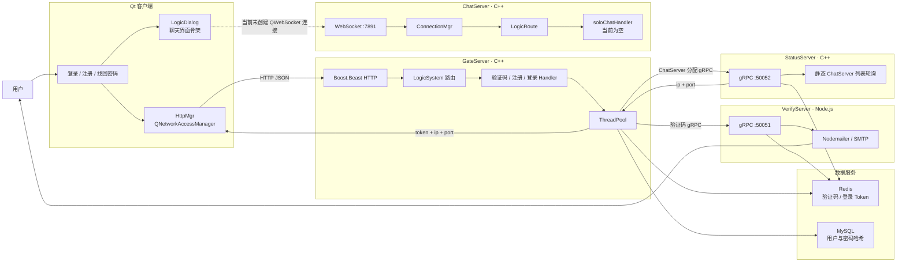

# 当前项目实际流程（代码快照）

> 核对基线：`main` 分支提交 `ab22a0e`，核对日期：2026-08-15。  
> 本文只记录当前代码已经存在的调用链和实现边界，不代表目标架构。

## 1. 当前组件关系



## 2. 注册流程

1. Qt 客户端向 GateServer 发送 `POST /get_verify`，请求邮箱验证码。
2. GateServer 将请求交给线程池，再通过 gRPC 调用 VerifyServer。
3. VerifyServer 生成验证码，写入 Redis 的 `code_<email>`，并通过 SMTP 发送邮件。
4. 用户填写验证码后，客户端向 GateServer 发送 `POST /register`。
5. GateServer 使用 Redis Lua 脚本原子校验并消费验证码。
6. GateServer 使用 libsodium 生成密码哈希，再将用户写入 MySQL。

代码入口：

- [客户端验证码与注册请求](../client/registerpage.cpp)
- [GateServer 验证码路由](../server/GateServer/Work/WorkHandler/VarifyHandler.cpp)
- [GateServer 注册处理](../server/GateServer/Work/WorkHandler/RegisterHandler.cpp)
- [VerifyServer 邮件验证码](../server/VerifyServer/server.js)

## 3. 登录与 ChatServer 分配流程

1. Qt 客户端向 GateServer 发送 `POST /login`，提交 `email` 和 `password`。
2. GateServer 从 MySQL 查询密码哈希，并使用 libsodium 校验密码。
3. 校验成功后，GateServer 在 Redis 创建 `login:token:<email>` 登录令牌。
4. GateServer 通过 gRPC 把 `email + token` 发送给 StatusServer。
5. StatusServer 再从 Redis 验证 Token，并从配置中的 ChatServer 列表轮询选择地址。
6. GateServer 将 `email + token + ip + port` 返回给 Qt 客户端。
7. 客户端目前只把这些字段保存到 `LogicDialog` 的动态属性中并打开聊天界面。

当前实现到第 7 步结束；客户端尚未创建 WebSocket 连接。

代码入口：

- [客户端登录及会话字段保存](../client/mainwindow.cpp)
- [GateServer 登录处理](../server/GateServer/Work/WorkHandler/LoginHandler.cpp)
- [GateServer Status gRPC 客户端](../server/GateServer/Work/Grpc/StatusGrpcClient.cpp)
- [StatusServer 分配逻辑](../server/StatusServer/StatusServiceImpl.cpp)

## 4. ChatServer 当前处理骨架

ChatServer 当前具备以下基础链路：

```text
TCP 接入
  -> WebSocket 握手
  -> ConnectionMgr 保存连接
  -> 异步读取 JSON 帧
  -> LogicRoute 按 require 字段分发
  -> soloChatHandler / ErrorHandler
```

目前 `soloChatHandler` 没有业务实现，也没有用户身份与连接的绑定；因此真实聊天消息还没有形成端到端闭环。

代码入口：

- [WebSocket 接入](../server/ChatServer/ioLoop/WebSocketServer.cpp)
- [连接读写](../server/ChatServer/ioLoop/Connection.cpp)
- [消息路由](../server/ChatServer/route/LogicRoute.cpp)
- [单聊 Handler](../server/ChatServer/handler/soloChatHandler.cpp)

## 5. 当前端口快照

| 组件 | 当前来源 | 端口 |
|---|---|---:|
| GateServer | `config.ini.example` | 8080 |
| VerifyServer | `server.js` 硬编码 | 50051 |
| StatusServer | `config.ini.example` | 50052 |
| ChatServer 实际监听 | `main.cpp` 硬编码 | 7891 |
| StatusServer 配置的 ChatServer | `config.ini.example` | 9001、9002 |

以上内容是当前代码快照，后续功能完善时再同步更新本文。
