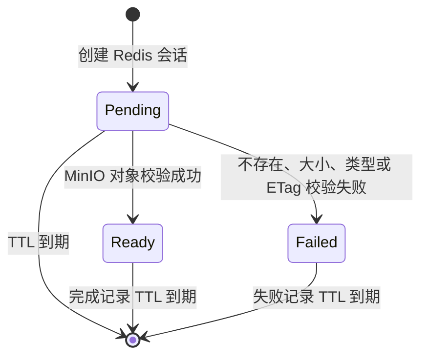
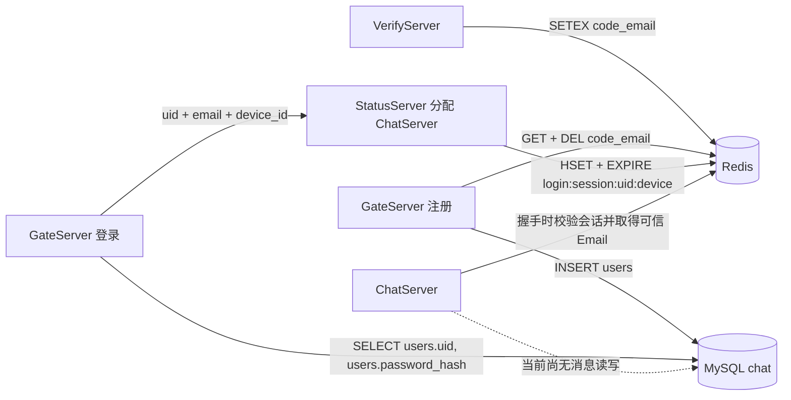

# 当前 Redis 与 MySQL 存储结构

> 更新时间：2026-08-25
>
> 文档版本：v1.2
>
> 范围：`VerifyServer`、`GateServer`、`StatusServer`、`ChatServer`、`FileServer` 当前源码
>
> 说明：本文区分“运行环境实测”“源码已使用”“实现中”和“规划”四种状态，不能把规划结构当成当前数据库结构。
>
> MySQL 实测：2026-08-25 对虚拟机 MySQL 执行元数据查询，版本为 `8.0.44`，Schema 为 `chat`；随后执行第 001 号字段重命名迁移。迁移前后均为 27 行，没有读取用户明细，也没有改写字段值。

## 1. 总览

```text
VerifyServer
  └─ Redis：写入邮箱验证码

GateServer
  ├─ Redis：消费验证码
  └─ MySQL：注册用户、查询 uid 与密码哈希

StatusServer
  └─ Redis：分配 ChatServer 后创建设备级登录会话

ChatServer
  ├─ RedisMgr：在 WebSocket Upgrade 阶段校验设备级登录会话
  ├─ RedisFileMgr：通用文件上传会话，实现中
  └─ MysqlMgr：已复制进项目，用户资料与消息持久化尚未完成

FileServer
  └─ MinIO：生成预签名上传 URL、查询对象元数据；不直接访问 Redis
```

当前真正投入业务使用的存储只有：

- Redis 邮箱验证码。
- Redis 设备级登录会话。
- MySQL `users` 表中的注册与登录数据。
- MinIO `chat-files` Bucket 中通过预签名 PUT 上传的对象。

当前尚未实现：

- 聊天消息。
- 单聊或群聊会话。
- 好友关系。
- 群组和群成员。
- 用户在线路由。
- 消息送达水位。
- 消息已读水位。
- 离线消息拉取。
- 正式文件、图片和视频元数据。
- Redis 通用文件上传会话的完整读写与状态转换。

## 2. Redis 当前实际结构

### 2.1 邮箱验证码

验证码由 `VerifyServer` 创建。

| 属性 | 当前值 |
|---|---|
| Redis 类型 | String |
| Key 格式 | `code_<email>` |
| Value | 4 位验证码 |
| TTL | 默认 180 秒 |
| 写入者 | VerifyServer |
| 消费者 | GateServer 注册接口 |

示例：

```text
Key:   code_user@example.com
Value: a3f2
TTL:   180 秒
```

VerifyServer 使用的等价 Redis 命令：

```redis
SETEX code_<email> 180 <code>
```

实现位置：

- `server/VerifyServer/server.js`
- `server/VerifyServer/redis.js`
- `server/VerifyServer/const.js`

如果 Key 已经存在，再次请求验证码时会复用原验证码，不会重新写入，因此不会刷新原 TTL。

#### 验证码消费

GateServer 注册时构造：

```cpp
const std::string redisKey =
    "code_" + email;
```

随后通过 Lua 脚本原子完成校验和删除：

```lua
local storedCode = redis.call("GET", KEYS[1])

if not storedCode then
    return 0
end

if storedCode ~= ARGV[1] then
    return -1
end

redis.call("DEL", KEYS[1])

return 1
```

| Lua 返回值 | C++ 结果 | 含义 | Key 是否删除 |
|---:|---|---|---|
| `1` | `Success` | 验证码正确 | 删除 |
| `0` | `CodeMissing` | 不存在、已过期或已使用 | 无 Key |
| `-1` | `CodeMismatch` | 验证码错误 | 保留 |
| 其他/Redis 异常 | `RedisError` | Redis 服务错误 | 不确定 |

因此验证码只能成功消费一次。

实现位置：

- `server/GateServer/Work/WorkHandler/RegisterHandler.cpp`
- `server/GateServer/Work/Redis/RedisMgr.cpp`

### 2.2 设备级登录会话

GateServer 验证密码后，将 MySQL 中可信的 `uid`、`email` 和客户端持久化的 `device_id` 交给 StatusServer。StatusServer 先分配 ChatServer，再生成 token 并创建 Redis 会话。

| 属性 | 当前值 |
|---|---|
| Redis 类型 | Hash |
| Key 格式 | `login:session:<uid>:<device_id>` |
| Hash 字段 | `uid`、`token`、`email`、`server_id`、`device_id` |
| TTL | 配置决定；当前配置为 3600 秒 |
| TTL 回退值 | 1800 秒 |
| 写入者 | StatusServer |
| 验证者 | ChatServer 的 `VerifyLoginSession()` |

示例：

```text
Key: login:session:42:10001

Hash:
  uid       = 42
  token     = <64 个十六进制字符>
  email     = user@example.com
  server_id = ChatServer1
  device_id = 10001

TTL: 3600 秒（设置在整个 Key 上）
```

token 生成方式：

```text
OpenSSL RAND_bytes 生成 32 字节安全随机数据
    ↓
每个字节转换为两个十六进制字符
    ↓
得到 64 字符 token
```

等价 Redis 操作：

```redis
HSET login:session:<uid>:<device_id> \
    uid <uid> \
    token <token> \
    email <email> \
    server_id <server_id> \
    device_id <device_id>
EXPIRE login:session:<uid>:<device_id> <ttl>
```

代码使用一个 Lua 脚本原子执行 `HSET` 和 `EXPIRE`，不会出现 Hash 已写入但忘记设置 TTL 的半完成状态。

当前会话语义是：

> 一个用户的每台设备分别拥有一个会话；同一设备重新登录会覆盖自己的旧 token，不会挤掉其他设备。

ChatServer 校验时同时比较 `uid`、`device_id`、`token` 和 `server_id`，匹配后才返回 Hash 中由登录链写入的可信 `email`。因此客户端不能通过 WebSocket 请求头伪造 Connection 中绑定的 Email，分配给 `ChatServer1` 的 token 也不能直接用于冒充 `ChatServer2` 会话。

实现位置：

- `server/GateServer/Work/WorkHandler/LoginHandler.cpp`
- `server/GateServer/Work/Grpc/StatusGrpcClient.cpp`
- `server/StatusServer/StatusServiceImpl.cpp`
- `server/StatusServer/RedisMgr.cpp`
- `server/ChatServer/redis/RedisMgr.cpp`

### 2.3 会话校验

校验接口：

```cpp
std::optional<LoginSessionInfo> RedisMgr::VerifyLoginSession(
    std::uint64_t uid,
    std::uint64_t deviceId,
    const std::string& token,
    const std::string& serverId)
{
    // 对 login:session:<uid>:<device_id> 执行 HMGET，
    // 四个安全字段全部相等后，返回包含可信 Email 的会话信息。
}
```

校验不会刷新 TTL。旧格式 `login:token:<email>` 已不再由新登录流程写入；Redis 中若仍有旧 Key，会按原 TTL 自然过期。

### 2.4 已封装但尚未用于正式业务的 Redis 操作

三份 `RedisMgr` 中还封装了：

| 操作 | Redis 类型或用途 |
|---|---|
| `Get/Set` | String |
| `LPush/LPop` | List |
| `RPush/RPop` | List |
| `HSet/HGet` | Hash |
| `Del` | 删除 Key |
| `ExistsKey` | 判断 Key 是否存在 |

GateServer 的 `TestRedisMgr()` 中存在以下演示 Key：

```text
blogwebsite
bloginfo
lpushkey1
lpushkey2
```

但 `TestRedisMgr()` 没有在 `main()` 中调用，所以这些不是服务器正常运行时产生的业务结构。

### 2.5 通用文件上传会话（设计已确定，代码实现中）

`RedisFileMgr` 用于保存一次文件上传从申请 URL 到完成校验之间的临时状态。它是通用文件上传会话，不与头像业务绑定，后续可供聊天图片、视频、语音、普通附件和分片大文件复用。

当前实现状态：

- `server/ChatServer/redis/RedisFileMgr.h` 已创建，并开始定义通用 `UploadSession` 数据模型。
- `server/ChatServer/redis/RedisFileMgr.cpp` 已创建。
- `CreateUploadSession()`、`GetUploadSession()` 和状态转换 Lua 尚未完成。
- `SetAvatarHandler` 尚未在返回 `upload_url` 前写入该结构。
- 因此，本节描述的是已经确定的存储契约，当前 Redis 实例中不保证存在这些 Key。

#### 2.5.1 服务职责

```text
ChatServer
  ├─ 校验已登录用户和上传业务参数
  ├─ 调用 FileServer 申请 MinIO 预签名 URL
  ├─ 在向客户端返回 URL 前创建 Redis 上传会话
  ├─ CompleteUpload 时读取 Redis 中的预期信息
  ├─ 比较预期信息与 FileServer 返回的 MinIO 实际信息
  └─ 验证成功后更新最终业务引用

FileServer
  ├─ 生成服务端控制的 object_key
  ├─ 生成 MinIO 预签名 PUT/GET URL
  └─ 使用 StatObject 查询 MinIO 实际对象元数据

Redis
  └─ 临时保存上传会话、预期元数据、状态和 TTL

MinIO
  └─ 保存文件二进制
```

FileServer 不直接访问 Redis。严格的“申请值与实际值比较”由 ChatServer 完成：

```text
Redis expected_size_bytes     == FileServer/MinIO actual_size_bytes
Redis expected_content_type   == FileServer/MinIO actual_content_type
Redis uploader_id             == Connection 中的已认证 uid
Redis object_key              == 客户端 CompleteUpload 提交的 file_id
```

#### 2.5.2 Redis Key

| 属性 | 设计值 |
|---|---|
| Redis 类型 | Hash |
| Key 格式 | `upload:session:{<session_id>}` |
| 创建者 | ChatServer 的 `RedisFileMgr` |
| 创建时机 | FileServer 返回 URL 后、ChatServer 向客户端返回 URL 前 |
| 初始状态 | `pending` |
| 初始 TTL | URL 剩余有效秒数向上取整，再增加 60 秒宽限 |
| 完成后 TTL | 计划保留 3600 秒，用于 CompleteUpload 幂等重试 |
| 失败后 TTL | 计划短期保留失败原因，再自动过期 |

示例：

```text
Key: upload:session:{a32178f2-d7e0-4af5-9d49-4eae32a84c31}
TTL: 660 秒
```

花括号中的 `session_id` 是 Redis Cluster hash tag。当前单机 Redis 不依赖该特性；如果后续增加分片上传，以下 Key 可以稳定落到同一 hash slot：

```text
upload:session:{<session_id>}
upload:parts:{<session_id>}
upload:lock:{<session_id>}
```

#### 2.5.3 Hash 字段

| 字段 | 示例 | 含义 | 写入阶段 |
|---|---|---|---|
| `session_id` | `a32178f2-...` | ChatServer 生成的一次上传会话 ID | InitUpload |
| `object_key` | `avatar/3/e1b0....png` | FileServer 生成的 MinIO 对象键 | InitUpload |
| `client_file_id` | `avatar-client-001` | 客户端幂等 ID | InitUpload |
| `uploader_id` | `3` | 来自已认证 `Connection` 的用户 ID | InitUpload |
| `conversation_id` | `0` | 文件所属会话；头像为 0 | InitUpload |
| `original_file_name` | `avatar.png` | 仅作显示信息，不参与对象键生成 | InitUpload |
| `expected_content_type` | `image/png` | 申请时经过业务校验的 MIME 类型 | InitUpload |
| `expected_size_bytes` | `58467` | 申请时经过业务校验的字节数 | InitUpload |
| `expected_sha256` | 空或 64 位十六进制 | 可选的预期内容摘要 | InitUpload |
| `purpose` | `1` | Protobuf `FilePurpose` 数值 | InitUpload |
| `upload_mode` | `single_put` | `single_put` 或后续的 `multipart` | InitUpload |
| `status` | `pending` | 上传会话当前状态 | InitUpload/状态转换 |
| `created_at_ms` | `1787643757500` | ChatServer 创建会话的毫秒时间戳 | InitUpload |
| `expires_at_ms` | `1787644357500` | FileServer 返回的 URL 过期时间 | InitUpload |
| `actual_content_type` | `image/png` | MinIO `StatObject` 返回的真实类型 | CompleteUpload |
| `actual_size_bytes` | `58467` | MinIO `StatObject` 返回的真实大小 | CompleteUpload |
| `etag` | `29c55162...` | MinIO 对象 ETag | CompleteUpload |
| `failure_reason` | `size_mismatch` | `failed` 状态的稳定失败原因 | CompleteUpload |

头像上传会话示例：

```text
Key: upload:session:{a32178f2-d7e0-4af5-9d49-4eae32a84c31}

Hash:
  session_id             = a32178f2-d7e0-4af5-9d49-4eae32a84c31
  object_key             = avatar/3/e1b0224f-2caa-4ccb-95bc-54939e750ad0.png
  client_file_id         = avatar-client-001
  uploader_id            = 3
  conversation_id        = 0
  original_file_name     = avatar.png
  expected_content_type  = image/png
  expected_size_bytes    = 58467
  expected_sha256        =
  purpose                = 1
  upload_mode            = single_put
  status                 = pending
  created_at_ms          = 1787643757500
  expires_at_ms          = 1787644357500

TTL: URL 剩余有效期 + 60 秒宽限
```

#### 2.5.4 `session_id` 与 `object_key`

二者不能混为同一个概念：

| 字段 | 生命周期 | 用途 |
|---|---|---|
| `session_id` | 一次上传尝试 | Redis 会话 Key、CompleteUpload 查找、重试与状态机 |
| `object_key` | 一个 MinIO 对象 | 预签名 URL、StatObject、正式文件引用 |

同一个逻辑文件重新上传时应生成新的 `session_id` 和新的对象键。客户端 CompleteUpload 时需要同时提交 `session_id`、`file_id/object_key` 和可选 ETag；ChatServer 必须确认客户端提交的对象键与 Redis 中保存的 `object_key` 完全相同。

#### 2.5.5 创建会话的原子操作

创建上传会话必须原子完成：

```text
检查 session_id 不存在
    +
HSET 全部申请字段
    +
EXPIRE 整个 Hash
```

计划使用的 Lua 语义：

```lua
local ttl = tonumber(ARGV[14])

if not ttl or ttl <= 0 then
    return -1
end

if redis.call("EXISTS", KEYS[1]) == 1 then
    return 0
end

redis.call(
    "HSET",
    KEYS[1],
    "session_id", ARGV[1],
    "object_key", ARGV[2],
    "client_file_id", ARGV[3],
    "uploader_id", ARGV[4],
    "conversation_id", ARGV[5],
    "original_file_name", ARGV[6],
    "expected_content_type", ARGV[7],
    "expected_size_bytes", ARGV[8],
    "expected_sha256", ARGV[9],
    "purpose", ARGV[10],
    "upload_mode", ARGV[11],
    "status", "pending",
    "expires_at_ms", ARGV[12],
    "created_at_ms", ARGV[13]
)

redis.call("EXPIRE", KEYS[1], ttl)
return 1
```

| Lua 返回值 | 计划映射 | 含义 |
|---:|---|---|
| `1` | `Success` | 会话创建成功 |
| `0` | `AlreadyExists` | `session_id` 已存在，禁止覆盖 |
| `-1` | `InvalidData` | TTL 非法 |
| Redis 异常 | `RedisError` | 连接、命令或脚本执行失败 |

只有 Lua 返回 `Success` 后，ChatServer 才能把 `upload_url` 发送给客户端。Redis 写入失败时，FileServer 已生成但尚未暴露给客户端的 URL 直接废弃即可。

#### 2.5.6 状态机与幂等

第一阶段状态机：



状态字符串固定为小写：

```text
pending
ready
failed
```

`pending -> ready` 和 `pending -> failed` 必须由 Lua 比较旧状态后原子执行。重复 CompleteUpload 遇到 `ready` 时应返回之前的成功结果，而不是返回“会话不存在”；因此成功后不立即删除 Hash，而是延长 TTL，支持网络丢包后的幂等重试。

#### 2.5.7 大文件扩展

通用会话通过：

```text
upload_mode = single_put
upload_mode = multipart
```

区分单次 PUT 与分片上传。后续大文件可增加：

```text
Key: upload:parts:{<session_id>}

Hash:
  <part_number> = <part_etag>
```

基础会话仍保存在 `upload:session:{<session_id>}`，头像和大文件共享所有者、用途、预期大小、状态、TTL 和幂等语义；只有分片明细使用额外 Key。

#### 2.5.8 计划接口与实现位置

实现位置：

```text
server/ChatServer/redis/RedisFileMgr.h
server/ChatServer/redis/RedisFileMgr.cpp
```

计划接口：

```cpp
RedisFileResult CreateUploadSession(
    const UploadSession& session,
    std::chrono::seconds ttl);

UploadSessionLookupResult GetUploadSession(
    const std::string& session_id);

RedisFileResult MarkUploadReady(...);

RedisFileResult MarkUploadFailed(...);
```

`RedisFileMgr` 复用现有 `RedisPool`、`RedisConGuard` 和 `RedisReplyMgr`，但不负责登录会话、验证码、MinIO 或 MySQL 操作。

### 2.6 Redis 当前尚未实现的在线路由结构

分布式 ChatServer 后续需要增加用户在线路由，例如：

```text
Key: chat:online:user:<user_id>
```

建议保存：

```json
{
  "server_id": "chat-server-1",
  "connection_id": "conn-abcd",
  "device_id": 30001,
  "session_id": "session-xyz"
}
```

并通过心跳刷新 TTL。但该结构目前尚未实现，不能算作当前存储。

## 3. MySQL 当前实际结构

### 3.1 实测来源

本节不再只根据 C++ 查询语句反推表结构。2026-08-25 已使用项目现有 MySQL 配置连接虚拟机，并执行以下只读元数据查询：

```sql
SELECT VERSION(), DATABASE(), @@hostname;
SHOW TABLES;
SHOW CREATE TABLE users;
SHOW FULL COLUMNS FROM users;
SHOW INDEX FROM users;
```

实测结果：

| 属性 | 当前值 |
|---|---|
| MySQL 版本 | `8.0.44` |
| Schema | `chat` |
| 当前表数量 | 1 |
| 当前表 | `users` |

这些查询只读取数据库元数据，没有查询用户记录，也没有执行任何 DDL 或 DML 写操作。

### 3.2 users 真实建表结构

当前虚拟机中的真实 DDL 为：

2026-08-25 已执行：

```text
database/migrations/001_重命名用户头像和密码字段.sql
```

该迁移只重命名两个字段：

```text
avatar_url -> avatar_file_id
pwd        -> password_hash
```

迁移前后 `users` 均为 27 行，已有字段值保持不变。

```sql
CREATE TABLE `users` (
  `uid` bigint unsigned NOT NULL AUTO_INCREMENT,
  `name` varchar(64) NOT NULL,
  `avatar_file_id` varchar(512) NOT NULL DEFAULT '',
  `signature` varchar(255) NOT NULL DEFAULT '',
  `email` varchar(254) NOT NULL,
  `password_hash` varchar(255) NOT NULL,
  `status` tinyint unsigned NOT NULL DEFAULT '1',
  `created_at` timestamp NOT NULL DEFAULT CURRENT_TIMESTAMP,
  `updated_at` timestamp NOT NULL DEFAULT CURRENT_TIMESTAMP
      ON UPDATE CURRENT_TIMESTAMP,
  PRIMARY KEY (`uid`),
  UNIQUE KEY `uk_users_email` (`email`),
  CONSTRAINT `chk_users_status` CHECK (`status` IN (0, 1))
) ENGINE=InnoDB
  DEFAULT CHARSET=utf8mb4
  COLLATE=utf8mb4_0900_ai_ci;
```

`AUTO_INCREMENT` 的当前计数属于运行时状态，因此不写入结构文档，也不应写入迁移脚本。

### 3.3 users 字段说明

| 字段 | 类型 | 默认值 | 当前含义 | C++ 当前使用情况 |
|---|---|---|---|---|
| `uid` | `BIGINT UNSIGNED` | 自增 | 用户稳定主键 | 登录时查询并传给 StatusServer、ChatServer |
| `name` | `VARCHAR(64)` | 无 | 用户显示名称 | 注册时写入；用户资料查询尚未实现 |
| `avatar_file_id` | `VARCHAR(512)` | 空字符串 | MinIO 稳定对象键 | 当前尚未实现用户头像 DAO |
| `signature` | `VARCHAR(255)` | 空字符串 | 用户个性签名 | 当前没有 DAO 读写 |
| `email` | `VARCHAR(254)` | 无 | 登录账号 | 注册、查重和登录查询使用 |
| `password_hash` | `VARCHAR(255)` | 无 | libsodium 密码哈希 | 注册写入、登录读取 |
| `status` | `TINYINT UNSIGNED` | `1` | `0` 停用，`1` 正常 | 当前登录代码没有检查，属于权限漏洞 |
| `created_at` | `TIMESTAMP` | 当前时间 | 账号创建时间 | 数据库自动维护，当前 DAO 不读取 |
| `updated_at` | `TIMESTAMP` | 当前时间 | 用户记录更新时间 | 数据库自动维护，当前 DAO 不读取 |

因此，`users` 当前不是三个字段，而是九个字段。旧版文档只列出了旧注册 SQL 中出现的 `name`、`email` 和 `pwd`，遗漏了真实表里的另外六个字段。

### 3.4 索引和约束

当前实测存在：

| 名称 | 类型 | 字段或表达式 | 作用 |
|---|---|---|---|
| `PRIMARY` | 主键 BTREE | `uid` | 用户唯一标识和聚簇索引 |
| `uk_users_email` | 唯一 BTREE | `email` | 保证邮箱不能重复注册，也加速登录查询 |
| `chk_users_status` | CHECK | `status IN (0, 1)` | 限制账号状态值 |

当前没有外键，因为数据库中还没有其他业务表。

### 3.5 当前源码实际执行的 SQL

#### 注册前查重

```sql
SELECT 1
FROM users
WHERE email = ?
LIMIT 1;
```

#### 注册用户

```sql
INSERT INTO users(name, email, password_hash)
VALUES (?, ?, ?);
```

未显式插入的 `avatar_file_id`、`signature`、`status`、`created_at` 和 `updated_at` 由数据库默认值填充。

`password_hash` 不是明文密码。GateServer 使用：

```cpp
PasswordHasher::HashPassword(password);
```

生成 libsodium 密码哈希字符串。

#### 登录查询

```sql
SELECT uid, password_hash
FROM users
WHERE email = ?
LIMIT 1;
```

随后通过：

```cpp
PasswordHasher::VerifyPassword(
    password,
    passwordHash);
```

验证用户输入的密码。旧版文档把该 SQL 错写成只查询 `pwd`，现已按当前字段名更正。

### 3.6 users 当前实现缺口

#### status 没有参与登录校验

数据库虽然有 `status` 和 `chk_users_status`，但 GateServer 登录 SQL 没有读取或过滤 `status`。这意味着将用户设置成 `status = 0` 后，按照当前代码仍然可以登录。

后续至少需要在登录查询中加入 `status`，并区分“用户不存在”和“账号已停用”。不能只依赖数据库约束，因为约束只保证状态值合法，不负责鉴权。

#### avatar_file_id 已统一为稳定对象标识

当前文件上传链路返回的是稳定对象标识：

```text
avatar/<uid>/<uuid>.<extension>
```

预签名下载 URL 会过期，不能持久化。数据库字段现已重命名为 `avatar_file_id`，明确只保存 MinIO 的稳定 `object_key/file_id`。

客户端需要显示头像时，由 ChatServer 携带该 `file_id` 向 FileServer 申请短期下载 URL。任何代码都不得把预签名 URL 写入 `avatar_file_id`。

#### 用户资料读取仍是空实现

ChatServer 已声明：

```cpp
Json::Value MysqlMgr::GetUserInfo(std::uint64_t uid);
```

但当前实现直接返回空 `Json::Value`，还没有读取：

- `name`
- `avatar_file_id`
- `signature`
- `status`

#### 密码重置仍未落库

GateServer 已注册重置密码 Handler，但 `ResetHandler::Handler()` 当前为空，因此还没有安全的密码更新 SQL。

### 3.7 users 后续升级结构（规划，尚未执行）

第一阶段不需要无限增加字段。建议在现有九个字段基础上做语义修正，并补充真正有业务用途的字段：

| 目标字段 | 来源 | 规划用途 |
|---|---|---|
| `uid` | 保留 | 用户稳定主键 |
| `name` | 保留 | 显示名称 |
| `avatar_file_id` | 已完成重命名 | 保存稳定 MinIO 对象键，不保存预签名 URL |
| `background_file_id` | 计划新增 | 保存用户背景图的稳定 MinIO 对象键 |
| `signature` | 保留 | 个性签名 |
| `email` | 保留 | 登录账号，继续保持唯一索引 |
| `password_hash` | 已完成重命名 | 明确字段保存的是密码哈希，而不是密码明文 |
| `status` | 保留 | 账号启用或停用，并接入登录校验 |
| `profile_version` | 计划新增 | 用户资料每次成功更新后递增，用于推送去重、乱序判断和断线重连 |
| `created_at` | 保留 | 创建时间 |
| `updated_at` | 保留 | 更新时间 |
| `last_login_at` | 可选新增 | 最近一次成功登录时间 |
| `deleted_at` | 可选新增 | 将来需要软删除账号时使用 |

第 001 号迁移已经与 GateServer、ChatServer DAO 修改同步完成。后续增加 `background_file_id` 和 `profile_version` 时，也必须继续通过独立迁移脚本执行。

### 3.8 ChatServer 中的 MySQL 现状

ChatServer 当前包含从 GateServer 演化而来的用户 DAO：

```text
server/ChatServer/mysql/MysqlDao.cpp
server/ChatServer/mysql/MysqlMgr.cpp
```

其中 `GetUserInfo(uid)` 仍为空实现，也没有聊天消息存储接口。后续需要按服务职责逐步替换为：

```cpp
GetUserProfile();
UpdateAvatarFileId();
SaveMessage();
FindMessageByClientId();
AllocateConversationSeq();
LoadMessagesAfterSeq();
UpdateDeliveredSeq();
UpdateReadSeq();
```

## 4. 当前真实数据流



## 5. 当前问题汇总

### P0：WebSocket 鉴权仍缺少传输加密和超时

ChatServer 已在 HTTP Upgrade 阶段调用 `VerifyLoginSession()`，校验通过后绑定可信用户信息：

```cpp
AuthSession{
    .uid = ...,
    .device_id = ...,
    .email = ...
};
```

当前仍使用明文 `ws://`，正式环境需要升级为 `wss://`；握手阶段还应增加读取和鉴权超时，避免未完成握手的连接长期占用资源。

### P1：数据库迁移基础设施仍不完整

仓库已经有第一份增量迁移：

```text
database/migrations/001_重命名用户头像和密码字段.sql
```

但仍缺少创建 `users` 的基线迁移、迁移历史表和自动执行工具，所以仓库目前仍不能从空数据库独立重建完整 Schema。

### P1：ChatServer 复制了不属于它的用户注册接口

ChatServer 当前复制的是 GateServer 的用户 DAO。后续应把业务改为消息相关接口，而不是继续调用：

```cpp
RegisterUser();
GetPasswordHash();
```

## 6. 后续需要增加的 MySQL 表

账号、文件和聊天最小闭环至少需要：

```text
files
conversations
conversation_members
messages
user_conversation_state
friend_requests
friendships
```

它们分别负责：

| 表 | 职责 |
|---|---|
| `files` | 保存已经完成校验的文件元数据、所有者、所属会话和稳定对象键 |
| `conversations` | 单聊或群聊会话以及下一个会话序号 |
| `conversation_members` | 会话成员和成员权限 |
| `messages` | 消息正文、幂等 ID 和会话顺序 |
| `user_conversation_state` | 每位用户的送达与已读水位 |
| `friend_requests` | 好友申请、处理结果和幂等关系 |
| `friendships` | 已建立的双向好友关系 |

这些属于下一阶段设计，当前数据库代码中还不存在。

## 7. 结论

当前真实存储能力可以概括为：

```text
Redis
├─ code_<email>                邮箱验证码，一次性消费
├─ login:session:<uid>:<device_id>
   ├─ uid
   ├─ token
   ├─ email
   ├─ server_id
   └─ device_id                整个 Hash 带 TTL
└─ upload:session:{<session_id>}（实现中）
   ├─ uploader_id / object_key
   ├─ expected_size / expected_content_type
   ├─ purpose / upload_mode / status
   └─ created_at / expires_at  整个 Hash 带 TTL

MySQL chat
└─ users
   ├─ uid                      BIGINT UNSIGNED 主键
   ├─ name / signature         用户资料
   ├─ avatar_file_id           MinIO 稳定对象键，头像 DAO 尚未接入
   ├─ email                    唯一登录账号
   ├─ password_hash            libsodium 密码哈希
   ├─ status                   0/1，当前登录尚未检查
   └─ created_at / updated_at  数据库自动维护
```

ChatServer 已在 WebSocket Upgrade 阶段接入 `VerifyLoginSession()`。当前文件业务的下一步是完成 `RedisFileMgr` 的通用上传会话读写，在 `SetAvatarHandler` 返回预签名 URL 前原子创建会话，再实现 CompleteUpload 的严格校验和状态转换；聊天领域仍需继续建立消息、会话和用户会话水位表。
