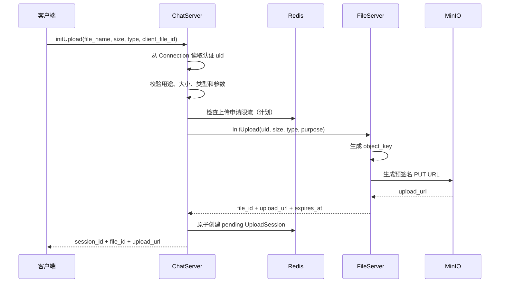
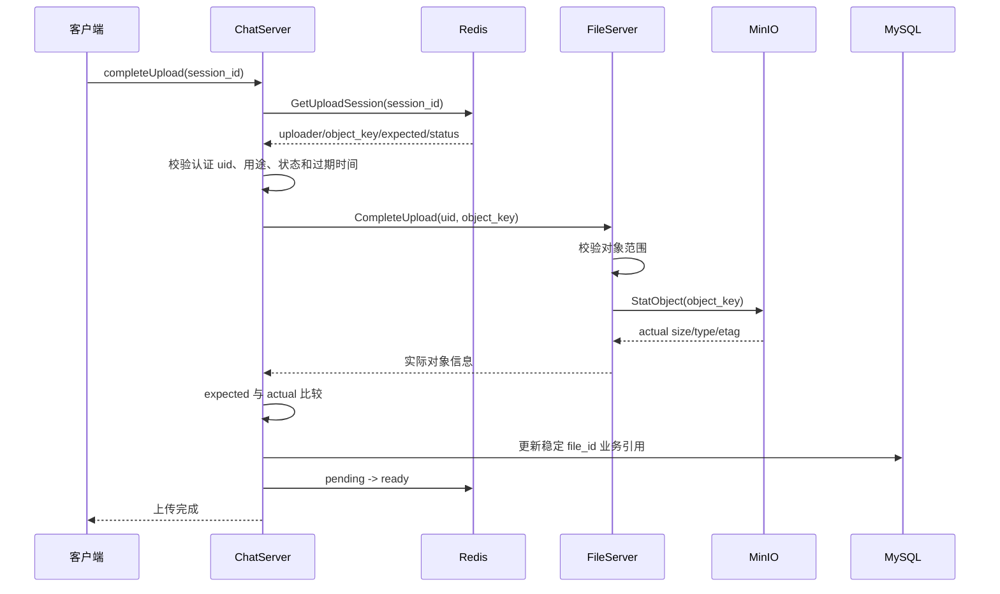
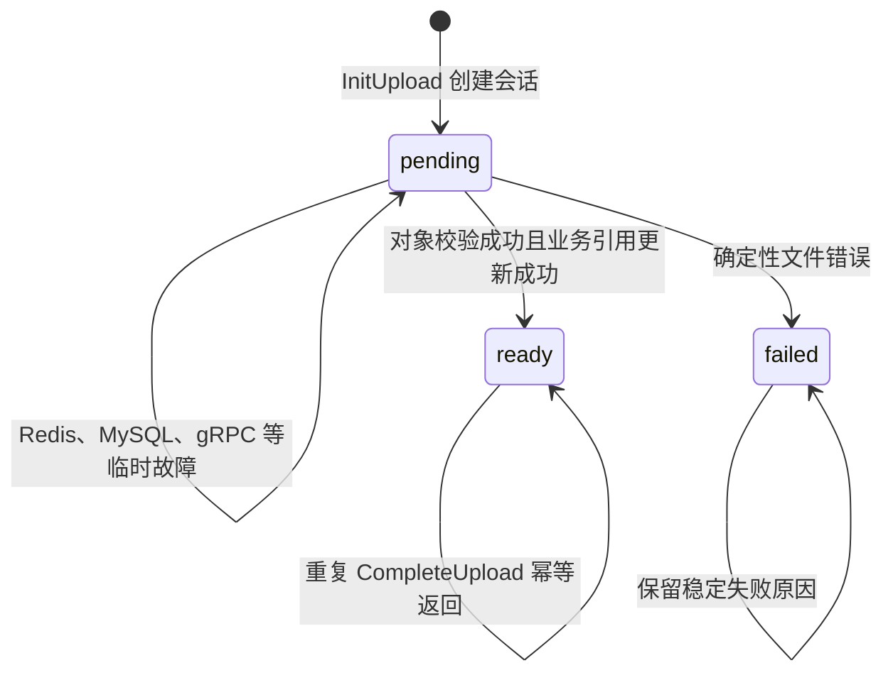

# 文件上传架构与标识符约定

> 状态：架构约定与当前实现说明
>
> 最近核对：2026-09-02
>
> 适用范围：头像、用户背景、聊天图片、视频、音频和普通附件

## 1. 文档目的

本文记录文件上传链路中的服务职责、信任边界和标识符语义，重点回答以下问题：

- `session_id`、`client_file_id`、`file_id` 和 `object_key` 分别表示什么；
- `file_id` 为什么包含 `uploader_id`，这种关系由谁保证；
- ChatServer、FileServer、Redis、MySQL 和 MinIO 各自负责什么；
- 为什么既要校验 Redis 中的 `uploader_id`，又要检查对象键前缀；
- 客户端直传 MinIO 后，服务端如何安全地完成业务确认；
- 当前第一版实现与后续通用文件系统之间有哪些差异。

Redis 和 MySQL 的具体字段、类型及示例见：[当前Redis与MySQL存储结构.md](./当前Redis与MySQL存储结构.md)。

## 2. 核心结论

当前架构遵守以下原则：

1. 客户端不持有 MinIO 的长期 Access Key 和 Secret Key；
2. FileServer 生成短期预签名 URL，客户端使用该 URL 直接上传到 MinIO；
3. ChatServer 负责认证、业务参数校验、上传会话、幂等和最终业务引用；
4. FileServer 只负责对象存储操作，不读取 Redis，也不修改用户业务数据；
5. MinIO 只认识 bucket 和 object key，不理解用户、会话或头像等业务概念；
6. Redis 保存一次上传尝试的临时状态，MySQL 保存最终稳定业务引用；
7. 预签名 URL 不能持久化，MySQL 只保存稳定的 `file_id/object_key`；
8. 任何来自客户端的用户 ID、对象键、大小和类型都不能直接视为可信数据。

## 3. 标识符语义

| 标识符 | 生成方 | 生命周期 | 当前用途 |
|---|---|---|---|
| `uid` / `uploader_id` | 用户系统 / ChatServer 认证态 | 用户生命周期 | 表示上传会话的所有者 |
| `client_file_id` | 客户端 | 一次客户端上传意图 | 网络重试时进行幂等识别 |
| `session_id` | 服务端 | 一次上传尝试 | Redis Key、状态机和 CompleteUpload 查询 |
| `file_id` | FileServer | 文件生命周期 | 暴露给业务层的稳定文件标识 |
| `object_key` | FileServer | MinIO 对象生命周期 | MinIO 中定位对象的完整键 |
| `upload_url` | FileServer | 数分钟 | 临时上传权限，禁止写入数据库 |
| `etag` | MinIO | 对象版本生命周期 | 辅助确认上传结果，不能等同于通用内容哈希 |

### 3.1 当前第一版的值相等关系

当前头像上传实现为了减少第一次联调的映射层，暂时使用：

```text
session_id == file_id == object_key
```

例如：

```text
avatar/3/83cbd209-b75c-4f24-bbcc-b12fa89940ff.png
```

当前代码中：

- FileServer 将完整 `object_key` 作为 `file_id` 返回；
- ChatServer 将 FileServer 返回的 `file_id` 同时写入 Redis 的 `session_id` 和 `object_key`；
- WebSocket 响应仍然分别返回 `session_id` 和 `file_id`，保留协议演进空间。

值暂时相等不代表概念相同。长期设计仍然应保持：

```text
session_id：描述一次上传尝试
file_id：描述一个稳定文件
object_key：描述对象存储中的位置
```

当后续增加重传、审核、缩略图、转码、对象迁移或多版本文件时，它们可以自然拆分。例如：

```text
session_id = 52e57aaf-...
file_id    = file_f12ac9...
object_key = avatar/3/83cbd209-....webp
```

业务代码不得依赖三者永远相等。

### 3.2 `file_id` 与 `uploader_id` 的关系

当前头像对象键格式为：

```text
avatar/{uploader_id}/{server_generated_uuid}.{extension}
```

例如：

```text
avatar/3/83cbd209-b75c-4f24-bbcc-b12fa89940ff.png
       │
       └── uploader_id = 3
```

这是一条由 FileServer 实现的业务命名约定，不是 MinIO 自动创建的用户关系。

MinIO 看到的只有：

```text
bucket     = chat-files
object_key = avatar/3/83cbd209-b75c-4f24-bbcc-b12fa89940ff.png
```

MinIO 不知道 `avatar` 表示头像，也不知道路径中的 `3` 表示用户 ID。因此，Redis 仍然必须单独保存：

```text
uploader_id = 3
object_key  = avatar/3/83cbd209-b75c-4f24-bbcc-b12fa89940ff.png
```

对象键中的用户前缀用于存储分区和第二层防御，Redis 中的 `uploader_id` 才用于上传会话所有权校验。

### 3.3 `file_id` 当前是对象键，不是数据库自增 ID

当前 `file_id` 的值可以直接用于 FileServer 的：

- `StatObject`；
- `GetDownloadUrl`；
- `CompleteUpload`；
- 后续的 `DeleteObject` 或 `CopyObject`。

数据库的 `users.avatar_file_id` 保存该稳定值：

```text
avatar/3/83cbd209-b75c-4f24-bbcc-b12fa89940ff.png
```

禁止保存以下预签名 URL：

```text
http://minio-host/chat-files/avatar/3/...png?X-Amz-Signature=...
```

预签名 URL 会过期，不能作为头像的长期标识。

## 4. 服务职责与边界

### 4.1 ChatServer

ChatServer 是文件业务的编排者，负责：

- 从已认证 `Connection` 获取当前 `uid`；
- 校验客户端 JSON、文件用途、声明大小和允许的 MIME 类型；
- 调用 FileServer 申请预签名上传 URL；
- 在返回 URL 前创建 Redis 上传会话；
- CompleteUpload 时读取 Redis 中的预期信息；
- 校验上传会话所有者、用途、状态和过期时间；
- 比较 Redis 预期值与 FileServer 返回的 MinIO 实际值；
- 成功后更新 MySQL 中的最终业务引用；
- 原子执行 Redis `pending -> ready/failed`；
- 在 `initUpload` 入口执行 Redis 限流。

ChatServer 不应：

- 持有或转发整个文件二进制；
- 相信客户端 JSON 中自行填写的 `uploader_id`；
- 把客户端提交的任意对象键直接交给 FileServer；
- 把预签名 URL 写入 MySQL。

### 4.2 FileServer

FileServer 是对象存储适配层，负责：

- 根据服务端规则生成 `object_key`；
- 根据允许的 MIME 类型确定扩展名；
- 生成短期 MinIO 预签名 PUT/GET URL；
- 使用 `StatObject` 查询对象是否存在以及实际元数据；
- 后续实现对象复制、删除、生命周期和分片上传等存储操作；
- 对内部 RPC 参数进行必要的防御性校验。

FileServer 不应：

- 读取 Redis 上传会话；
- 判断用户是否已经登录；
- 更新 MySQL 用户头像字段；
- 保存 ChatServer 的业务状态机；
- 使用客户端原始文件名拼接对象键。

### 4.3 Redis

Redis 保存短期、可过期且需要原子状态转换的数据：

```text
upload:session:{<session_id>}
```

主要字段包括：

```text
session_id
object_key
client_file_id
uploader_id
conversation_id
expected_content_type
expected_size_bytes
purpose
upload_mode
status
created_at_ms
expires_at_ms
```

CompleteUpload 成功或失败后，再保存：

```text
actual_content_type
actual_size_bytes
etag
failure_reason
```

Redis 还计划承担上传 URL 申请限流。限流记录的是 `initUpload` 申请次数，不是客户端直接访问 MinIO 的实际 PUT 次数。

### 4.4 MySQL

MySQL 保存长期业务事实，例如：

```text
users.avatar_file_id
users.background_file_id
message.file_id
```

只有文件已经完成校验并可以被业务使用后，才允许把稳定 `file_id` 写入 MySQL。

### 4.5 MinIO

MinIO 负责：

- 保存对象二进制；
- 根据 bucket 和 object key 定位对象；
- 校验预签名 URL；
- 返回对象大小、Content-Type、ETag 和用户元数据；
- 执行 bucket 配额和生命周期策略。

MinIO 不理解 ChatServer 的登录态、上传会话或用户资料。

## 5. 信任边界

### 5.1 信息可信度

| 信息 | 来源 | 是否可信 | 正确处理方式 |
|---|---|---|---|
| 当前用户 ID | 已认证 `Connection` | 可信 | 作为 `uploader_id` 的唯一来源 |
| JSON 中的用户 ID | 客户端 | 不可信 | 不读取或忽略 |
| `client_file_id` | 客户端 | 不可信但可用于幂等 | 校验格式、长度和作用域 |
| 文件名 | 客户端 | 不可信 | 只作显示信息，不生成路径 |
| 声明大小 | 客户端 | 不可信 | 先做上限检查，完成时与实际值比较 |
| 声明 Content-Type | 客户端 | 不可信 | 使用允许列表，完成时与 MinIO 元数据比较 |
| `session_id` | 客户端回传 | 不可信 | 只用于查询 Redis，随后检查所有者和状态 |
| `object_key` | FileServer / Redis | 可信边界内数据 | CompleteUpload 从 Redis 取得，不直接信任客户端 |
| 实际对象大小 | FileServer 查询 MinIO | 存储事实 | 与 Redis 的预期大小比较 |

### 5.2 权限校验的两层结构

第一层由 ChatServer 完成，是主要业务权限检查：

```text
session.uploader_id == authenticated_connection_uid
```

并且：

```text
session.object_key == file_id_passed_to_fileserver
session.purpose    == current_business_purpose
```

第二层由 FileServer 完成，是防御性对象范围检查。头像场景中：

```text
file_id.starts_with("avatar/" + uploader_id + "/")
```

例如用户 `3` 只能确认：

```text
avatar/3/...
```

不能确认：

```text
avatar/4/...
```

前缀必须包含最后的 `/`，否则 `avatar/3` 会错误匹配 `avatar/30/...`。

### 5.3 为什么只检查前缀不够

用户 `3` 可能拥有多个对象：

```text
avatar/3/old.png
avatar/3/new.png
avatar/3/another.png
```

它们都能通过 `starts_with("avatar/3/")`。因此前缀只能证明对象处于该用户的存储命名空间，不能证明它属于当前上传会话。

当前上传会话的严格对应必须由 Redis 保证：

```text
客户端 session_id
        ↓
Redis UploadSession
        ├── uploader_id
        ├── object_key
        ├── purpose
        └── status
```

ChatServer 调用 FileServer 时应使用 Redis 中的值：

```cpp
request.set_uploader_id(
    session.uploader_id);

request.set_file_id(
    session.object_key);
```

不能直接把客户端提交的 `file_id` 原样转发。

## 6. InitUpload 数据流



关键顺序：

```text
FileServer 返回 URL
        ↓
ChatServer 成功创建 Redis 会话
        ↓
ChatServer 才把 URL 返回客户端
```

如果 Redis 会话创建失败，ChatServer 不得向客户端发放 URL。

## 7. 客户端直传 MinIO

客户端使用 FileServer 返回的 URL：

```http
PUT /chat-files/avatar/3/<uuid>.png?... HTTP/1.1
Content-Type: image/png
Content-Length: <actual-size>

<file bytes>
```

当前预签名 URL 绑定请求方法、bucket、object key、host 和有效期。当前实现没有把 `Content-Type`、`Content-Length` 或完整文件内容加入签名。

因此当前安全模型是：

- ChatServer 在申请阶段限制声明大小和允许类型；
- Redis 保存预期大小和类型；
- FileServer 在 CompleteUpload 时查询实际对象信息；
- ChatServer 比较预期值和实际值；
- 不一致的对象不能成为正式业务引用；
- 通过 Redis 限制用户申请新上传 URL 的频率；
- 后续使用 bucket 配额、短 URL 有效期和临时对象清理降低滥用风险。

预签名 URL 在过期前通常可以重复写同一 object key。Redis 状态机能够限制业务完成操作，但无法直接统计客户端绕过 ChatServer、直接访问 MinIO 的 PUT 次数。

## 8. CompleteUpload 数据流

客户端 PUT 成功后发送：

```json
{
    "version": 1,
    "require": "setAvatar",
    "action": "completeUpload",
    "request_id": "avatar-complete-001",
    "data": {
        "session_id": "avatar/3/83cbd209-b75c-4f24-bbcc-b12fa89940ff.png"
    }
}
```

客户端只需要提交 `session_id`。`uploader_id`、`object_key`、预期大小和类型必须从认证态与 Redis 中取得。



### 8.1 ChatServer 必须检查

```text
session 存在
session.uploader_id == authenticated uid
session.purpose == 当前业务用途
session.status == pending，或 ready 时按幂等返回
session 未超过业务允许的完成时间
session.object_key 非空
```

FileServer 返回 MinIO 实际信息后继续检查：

```text
actual_size_bytes   == expected_size_bytes
actual_content_type == expected_content_type
actual object_key   == session.object_key
```

第一版允许 ETag 为空。后续协议返回实际 ETag 后，可增加可选 ETag 比较。

### 8.2 状态机



可以写入 `failed` 的确定性错误包括：

- 对象在合理完成窗口内仍不存在；
- 实际大小不匹配；
- Content-Type 不匹配；
- ETag 不匹配；
- 上传会话已经过期。

以下临时错误不能直接写成 `failed`：

- Redis 暂时不可用；
- FileServer 暂时不可用；
- gRPC 超时；
- MinIO 临时内部错误；
- MySQL 暂时不可用。

这些错误应保留 `pending`，允许客户端重试。

### 8.3 MySQL 与 Redis 的更新顺序

第一版建议使用：

```text
对象校验成功
    ↓
更新 MySQL 最终业务引用
    ↓
Redis pending -> ready
```

如果 MySQL 成功而 Redis 临时失败，客户端重试时可以幂等地再次写入相同 `file_id`，随后修复 Redis 状态。

如果先写 Redis `ready`，再更新 MySQL 失败，则重试可能看到 `ready` 后直接返回，导致 Redis 和 MySQL 不一致。

## 9. Redis 上传限流

上传限流的目标是限制用户获得新预签名 URL 和新对象键的速度。

第一版建议：

```text
每个用户、每种用途、每 60 秒最多申请 5 次
```

Redis Key 示例：

```text
upload:rate:init:avatar:{3}
```

使用 Lua 原子完成：

```text
INCR
首次设置 EXPIRE
比较最大次数
返回 allowed/current_count/retry_after
```

限流应放在 ChatServer 完成 JSON 和认证校验之后、调用 FileServer 之前：

```text
认证与参数校验
    ↓
Redis TryAcquireUploadPermit
    ↓
通过后调用 FileServer InitUpload
```

上传属于非核心功能，Redis 限流服务不可用时建议 fail closed，即暂时不发放新的写入 URL。

该限流不能把一条预签名 URL 变成真正的一次性 URL，因为 PUT 请求由客户端直接发送到 MinIO，不经过 ChatServer 和 Redis。

## 10. 不同文件用途的对象键

头像当前使用：

```text
avatar/{uploader_id}/{uuid}.{extension}
```

后续可以按业务用途扩展：

```text
background/{uploader_id}/{uuid}.{extension}
chat/image/{conversation_id}/{uuid}.{extension}
chat/video/{conversation_id}/{uuid}.{extension}
chat/audio/{conversation_id}/{uuid}.{extension}
chat/file/{conversation_id}/{uuid}.{extension}
```

聊天文件的核心业务范围是 `conversation_id`，对象键不一定包含 `uploader_id`。因此：

```cpp
file_id.starts_with(
    "avatar/" + uploader_id + "/")
```

只能作为头像场景的范围检查，不能直接复制成所有文件用途的通用规则。

长期应按 `purpose` 使用不同的范围校验策略，例如：

```text
AVATAR          -> avatar/{uid}/
USER_BACKGROUND -> background/{uid}/
CHAT_IMAGE      -> chat/image/{conversation_id}/
CHAT_FILE       -> chat/file/{conversation_id}/
```

ChatServer 还必须验证当前用户是否属于对应会话，不能因为知道 `conversation_id` 就获得上传权限。

## 11. 文件名、扩展名和 MIME 类型

客户端原始文件名：

```text
../../avatar.png
同名文件.png
恶意脚本.exe
```

都不能直接用于 `object_key`。FileServer 应当：

1. 只接受 ChatServer 已允许的 `FilePurpose` 和 MIME 类型；
2. 根据允许列表映射扩展名；
3. 使用服务端 UUID 生成对象名；
4. 将原始文件名单独保存为显示信息；
5. 后续在内容处理服务中验证真实文件格式。

例如：

```text
image/jpeg -> .jpg
image/png  -> .png
image/webp -> .webp
```

仅比较 Content-Type 不能证明文件内容一定是图片。生产头像链路还需要真实解码、尺寸限制、像素数量限制和重新编码。

## 12. 当前实现状态

截至 2026-09-02，源码状态如下：

| 功能 | 状态 |
|---|---|
| FileServer 生成头像对象键 | 已实现 |
| FileServer 生成预签名 PUT URL | 已实现 |
| 客户端 PUT 到 MinIO | 已联调成功 |
| ChatServer 创建 Redis UploadSession | 已实现并联调 |
| `session_id == file_id == object_key` 第一版映射 | 已实现 |
| Redis 读取完整 UploadSession | 已实现 |
| FileServer `CompleteUpload` | 实现中 |
| ChatServer gRPC `CompleteUpload` 客户端 | 尚未实现 |
| Redis `MarkUploadReady` | 已声明，尚未实现 |
| Redis `MarkUploadFailed` | 已声明，尚未实现 |
| SetAvatarHandler `completeUpload` 分支 | 尚未实现 |
| MySQL 更新 `avatar_file_id` | 尚未接入头像链路 |
| Redis 上传申请限流 | 已确定方案，尚未实现 |
| GetDownloadUrl 与头像显示 | 尚未完成完整链路 |

实现状态变化时应更新本节，架构约定发生变化时应同时检查本文和存储结构文档。

## 13. 必须长期保持的不变量

后续重构时必须保持：

```text
1. uploader_id 只来自认证后的 Connection
2. object_key 只由服务端生成
3. 原始文件名不参与对象键拼接
4. 预签名 URL 不写入 MySQL
5. CompleteUpload 不相信客户端重新提交的大小和类型
6. ChatServer 从 Redis 取得 object_key 后再调用 FileServer
7. FileServer 不读取 Redis，不更新用户业务数据
8. MinIO 实际信息必须与 Redis 预期信息比较
9. pending -> ready/failed 必须原子执行
10. 临时基础设施错误不能永久标记文件 failed
11. session_id、file_id、object_key 概念上保持独立
12. FileServer 的对象范围检查不能替代 ChatServer 的会话所有权检查
```

## 14. 相关源码

- `server/FileServer/grpc/RpcServre.cpp`：InitUpload、CompleteUpload 和对象键生成；
- `server/FileServer/minio/minioMgr.h/.cpp`：MinIO 预签名 URL 和 StatObject 封装；
- `server/FileServer/proto/server.proto`：FileService gRPC 协议；
- `server/ChatServer/grpc/FileGrpcClient.h/.cpp`：ChatServer 到 FileServer 的 gRPC 客户端；
- `server/ChatServer/handler/SetAvatarHandler.cpp`：头像上传业务编排；
- `server/ChatServer/redis/RedisFileMgr.h/.cpp`：上传会话与状态机；
- `docs/当前Redis与MySQL存储结构.md`：Redis 与 MySQL 具体存储结构。
