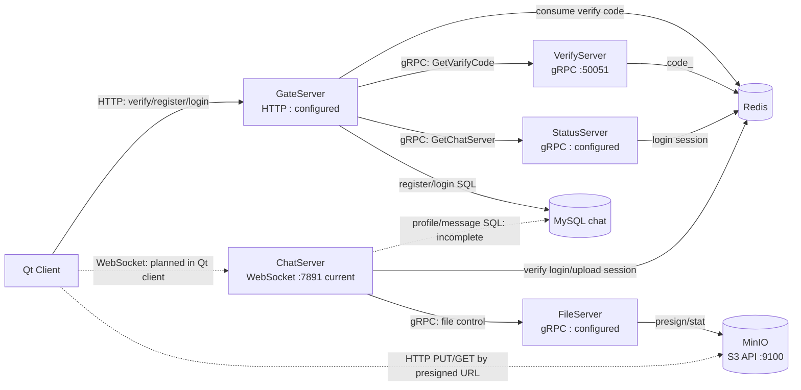
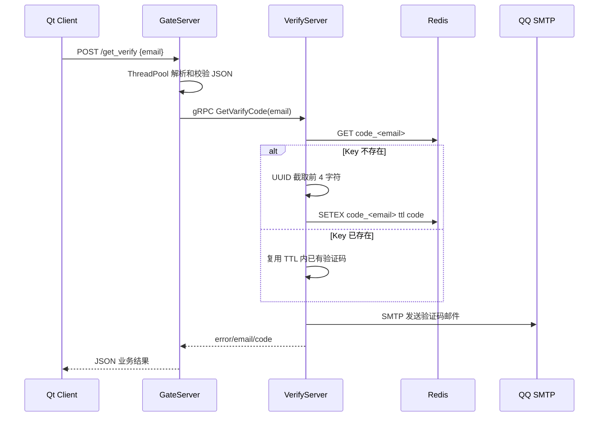
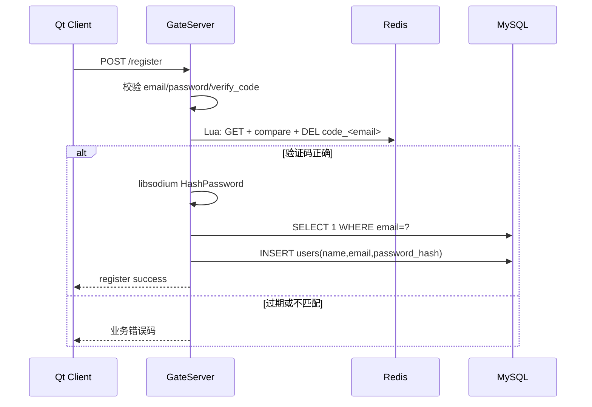
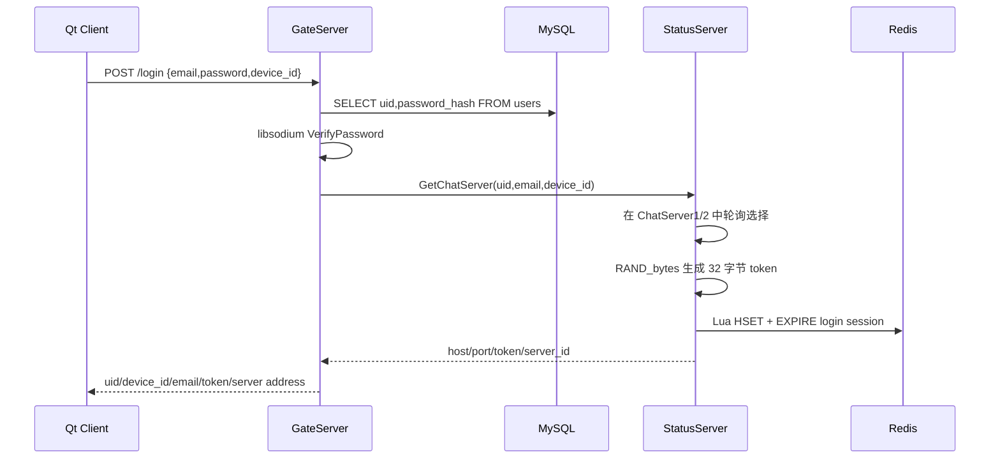
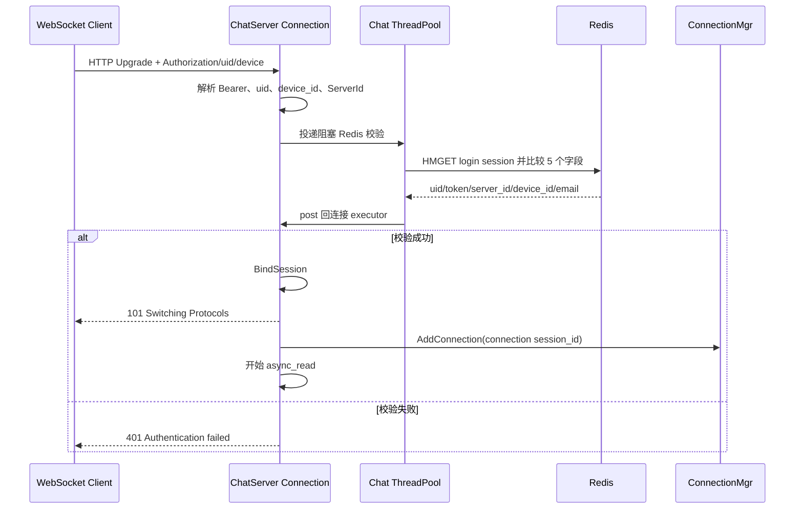
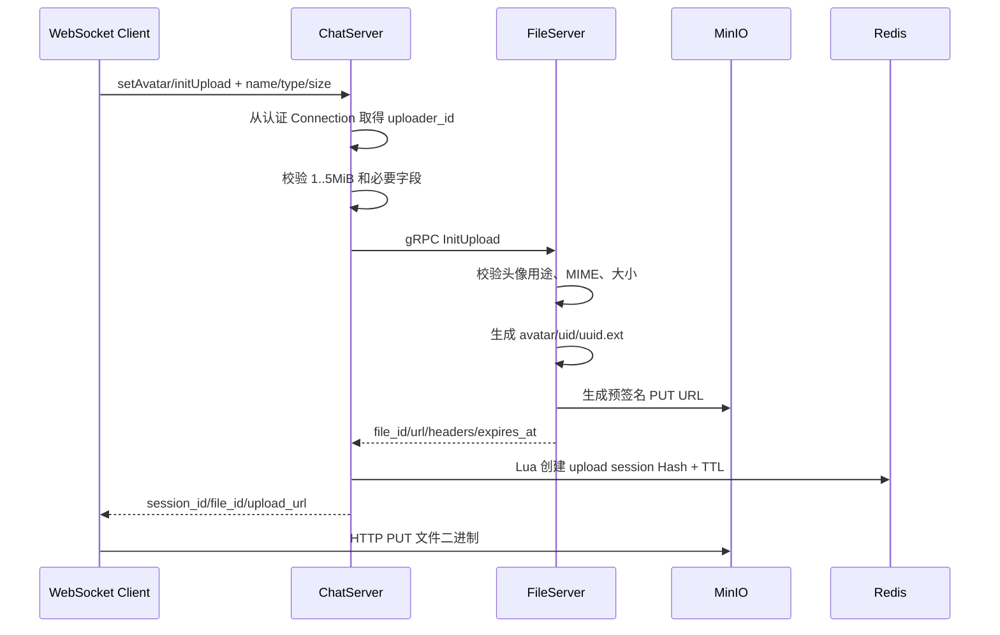
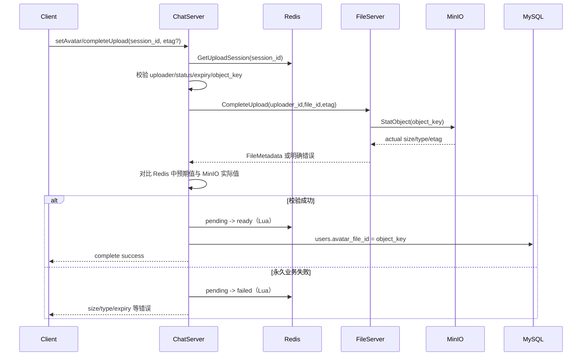
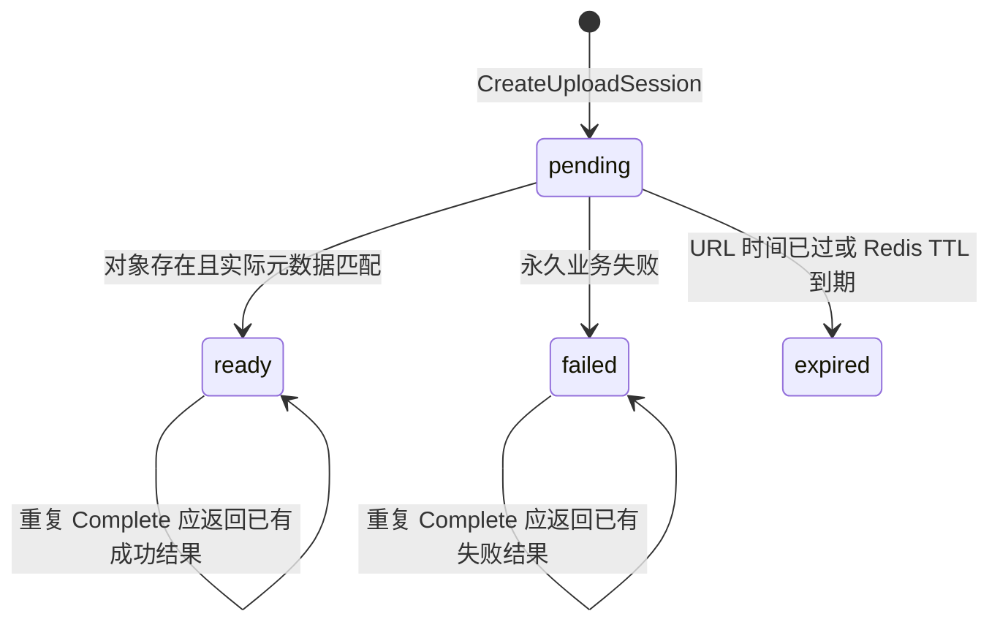

# 项目整体架构、服务流程与存储总览

> 文档性质：项目级架构与实现状态索引
> 源码快照：2026-09-02
> 适用仓库：`chat-fullstack` / `D:\repos\chat`
> 状态范围：包含当前工作区尚未提交的上传链路开发代码，相关功能提交后应再次校准状态表。
> 维护规则：功能、协议、配置或存储结构发生变化时，应同步修改本文中的流程、状态表和风险清单。

本文的目标不是描述一个理想中的聊天系统，而是回答下面四个实际问题：

1. 当前仓库里到底有哪些进程和模块；
2. 一个请求进入系统后，实际经过哪些类、线程、RPC 和存储；
3. Redis、MySQL、MinIO 分别保存什么，谁有权读写；
4. 哪些链路已经完成，哪些只是声明或规划，下一步应先做什么。

## 1. 阅读约定

本文使用以下状态：

| 标记 | 含义 |
|---|---|
| ✅ 已实现 | 当前源码中存在完整主流程，至少具备可调用实现 |
| 🟡 部分实现 | 已有入口或部分步骤，但端到端链路尚未闭合 |
| ⬜ 未实现 | 只有协议、声明、空函数或设计计划 |
| ⚠️ 风险 | 当前行为可运行，但存在明显的一致性、安全性或可维护性问题 |

本文是项目的总索引。更细的专项说明仍放在独立文档中：

- [当前Redis与MySQL存储结构](当前Redis与MySQL存储结构.md)
- [文件上传架构与标识符约定](文件上传架构与标识符约定.md)
- [多服务联合启动配置冲突](多服务联合启动配置冲突.md)
- [前后端网络请求与中文乱码问题](前后端网络请求与中文乱码问题.md)

## 2. 项目定位与系统边界

当前项目是一个由 Qt 客户端、C++ 服务、Node.js 验证码服务和基础存储组成的分布式即时通信系统雏形。

系统不是“一个 ChatServer 包办所有功能”，而是按职责拆分：

| 组件 | 核心职责 | 不应该承担的职责 |
|---|---|---|
| Qt Client | UI、用户输入、HTTP 请求、后续 WebSocket 和文件 PUT | 不能决定可信 `uid`、对象键或服务端权限 |
| GateServer | 对外 HTTP 网关、注册、登录、调用内部 gRPC | 不维持聊天长连接，不存文件二进制 |
| VerifyServer | 生成、缓存并发送邮箱验证码 | 不创建用户，不签发聊天登录 token |
| StatusServer | 选择 ChatServer、生成登录 token、写入登录会话 | 不验证密码，不处理聊天消息 |
| ChatServer | WebSocket 鉴权、长连接、业务消息路由、文件业务编排 | 不直接接收大文件，不把预签名 URL 当永久标识 |
| FileServer | MinIO 控制面：生成预签名 URL、查询对象元数据 | 第一版不直接操作 Redis/MySQL，不转发文件二进制 |
| Redis | 短期状态、会话、原子状态转换、后续限流 | 不作为永久用户资料的唯一来源 |
| MySQL | 用户账号和长期业务数据 | 不保存会过期的上传/下载 URL，不保存文件二进制 |
| MinIO | 文件二进制和对象元数据 | 不决定聊天业务权限和用户资料状态 |

### 2.1 总体拓扑



这里最重要的边界是：

- 小型控制消息经过 GateServer、ChatServer 和 FileServer；
- 文件二进制不经过 ChatServer 和 FileServer；
- 客户端拿到预签名 URL 后，直接与 MinIO 进行 HTTP PUT/GET；
- ChatServer 负责编排和权限，FileServer 负责对象存储控制面，MinIO 负责数据面。

## 3. 仓库与解决方案结构

```text
chat/
├─ chat.sln
├─ client/                  Qt 6 桌面客户端，CMake
├─ server/
│  ├─ GateServer/          C++ HTTP 网关
│  ├─ VerifyServer/        Node.js gRPC 邮箱验证码服务
│  ├─ StatusServer/        C++ gRPC 状态和路由服务
│  ├─ ChatServer/          C++ WebSocket 聊天服务
│  └─ FileServer/          C++ gRPC 文件控制服务
├─ proto/
│  └─ message.proto        Verify/Status 共享协议源
├─ database/
│  └─ migrations/          MySQL 增量迁移
├─ scripts/                Proto 生成和并发测试脚本
└─ docs/                   项目设计、存储和故障记录
```

根解决方案 `chat.sln` 当前包含四个 C++ 服务：

- GateServer
- StatusServer
- ChatServer
- FileServer

VerifyServer 是 Node.js 项目，Qt 客户端是 CMake 项目，因此不在 Visual Studio 顶层解决方案中。

⚠️ 根目录 `README.md` 仍把 ChatServer 描述成“预留”，也没有在最初的目录树里完整描述 FileServer，已经落后于当前源码。本文以实际源码和 `chat.sln` 为准。

## 4. 进程、协议、端口与依赖

| 进程或服务 | 对外/监听协议 | 当前端口来源 | 主要下游依赖 |
|---|---|---|---|
| Qt Client | HTTP 客户端；WebSocket 尚未接入 | `client/config.ini` 中 GateServer 地址 | GateServer；后续 ChatServer、MinIO |
| GateServer | HTTP/1.1，当前只接收 POST | `GateServer.ini [GateServer].Port` | VerifyServer、StatusServer、Redis、MySQL |
| VerifyServer | gRPC insecure | 源码硬编码 `0.0.0.0:50051` | Redis、QQ SMTP |
| StatusServer | gRPC insecure | `StatusServer.ini [StatusServer]` | Redis、静态 ChatServer 配置列表 |
| ChatServer | WebSocket over TCP | 源码当前硬编码 `7891` | Redis、FileServer；MySQL 类存在但业务未接入 |
| FileServer | gRPC insecure | `FileServer.ini [FileServer]` | MinIO |
| Redis | Redis TCP | 各服务自己的配置 | 被 Verify/Gate/Status/Chat 使用 |
| MySQL | MySQL TCP | GateServer 配置 | 当前主要被 GateServer 使用 |
| MinIO S3 API | HTTP，开发环境通常为 `9100` | `FileServer.ini [Minio].Endpoint` | 被 FileServer 和持有预签名 URL 的客户端访问 |
| MinIO Console | HTTP，开发环境通常为 `9101` | MinIO 启动参数 | 仅运维和人工检查使用 |

注意：`9100` 是对象 API，`9101` 是管理控制台。预签名上传 URL 必须指向对象 API，而不是控制台。

当前内部 gRPC 和开发环境 WebSocket 都没有 TLS。它们适合本机或受控内网联调，不代表生产部署方案。

## 5. 全局标识符与数据可信边界

### 5.1 用户和登录标识

| 标识 | 产生者 | 含义 | 是否可信 |
|---|---|---|---|
| `uid` | MySQL 自增主键 | 用户稳定身份 | 服务端查询得到时可信 |
| `email` | 用户输入，GateServer 查询 MySQL | 登录账号 | 登录成功后绑定到会话 |
| `device_id` | Qt 客户端持久化生成 | 一个客户端设备/安装实例 | 不是身份凭证，必须与 token 联合校验 |
| `token` | StatusServer 使用 OpenSSL 随机生成 | 短期登录凭证 | Redis 中匹配时可信 |
| `server_id` | StatusServer 分配，ChatServer 配置 | token 绑定的 ChatServer | 防止 token 被拿到其他 ChatServer 使用 |
| WebSocket `session_id` | ChatServer Connection 构造时生成 UUID | 一条网络连接的内部 ID | 只在 ChatServer 进程内使用 |

客户端不能只发送 `uid` 就证明自己是谁。当前 WebSocket 握手必须同时满足：

```text
Authorization: Bearer <token>
X-User-Id: <uid>
X-Device-Id: <device_id>
```

ChatServer 再用自己的 `ServerId` 查询并校验 Redis 登录会话。

### 5.2 文件标识

| 标识 | 含义 | 当前头像上传实现 |
|---|---|---|
| `client_file_id` | 客户端生成的幂等标识 | 可为空，当前还没有建立反向索引去重 |
| `session_id` | 一次上传尝试的服务端会话 ID | 第一版暂时等于 `file_id` |
| `file_id` | 返回给业务层的稳定文件标识 | 当前等于完整 MinIO `object_key` |
| `object_key` | MinIO Bucket 内对象路径 | `avatar/<uid>/<uuid>.<ext>` |
| `uploader_id` | 发起上传的已认证用户 | 来自 `Connection::GetUserId()`，不信任 JSON |

因此，`file_id` 不等于 `uploader_id`。

例如：

```text
uploader_id = 3
file_id     = avatar/3/83cbd209-b75c-4f24-bbcc-b12fa89940ff.png
```

`file_id` 的路径中包含 `uploader_id`，这样可以做快速归属检查，但真正完成上传时仍应读取 Redis 上传会话并比较：

```text
request uploader_id == session.uploader_id
request file_id      == session.object_key
session.status       == pending
```

只检查字符串前缀不能替代会话校验。

## 6. 端到端业务流程

### 6.1 推荐启动顺序

当前开发环境建议按依赖从底到顶启动：

1. Redis、MySQL、MinIO；
2. VerifyServer、FileServer、StatusServer；
3. GateServer、ChatServer；
4. Qt Client。

这样做不是因为所有服务启动时都会立即访问所有依赖，而是为了避免第一次请求触发单例/连接池初始化时才暴露配置或连接错误。

### 6.2 获取邮箱验证码：已实现



当前行为和风险：

- ✅ 验证码保存在 Redis String 中并设置 TTL；
- ✅ 同一邮箱在 TTL 内重复申请会复用已有验证码；
- ⚠️ VerifyServer gRPC 响应仍包含验证码 `code`，虽然 GateServer 没有转发它，但生产设计中不应返回；
- ⚠️ 当前没有邮箱级/IP 级发送限流；
- ⚠️ GateServer 的 Verify gRPC 调用没有设置 deadline；
- ⚠️ VerifyServer 监听端口硬编码为 `50051`。

### 6.3 注册：已实现主流程



这里使用 Lua 的原因是把“读取、比较、删除验证码”合并为一个原子操作，防止同一个验证码并发注册多次。

当前缺口：验证码在写 MySQL 之前就被删除。如果数据库临时故障，用户需要重新获取验证码。这是安全与用户体验之间的取舍，后续可以通过注册事务状态或有限补偿改进。

### 6.4 登录与 ChatServer 分配：已实现



登录会话 Key 为：

```text
login:session:<uid>:<device_id>
```

同一用户、同一设备再次登录会覆盖原来的 token 和 `server_id`，因此旧 token 会自然失效。

### 6.5 WebSocket 握手鉴权：服务端已实现，Qt 客户端未接入



Redis 阻塞查询在线程池执行，WebSocket 状态修改再投递回连接自己的 executor。这保证了 I/O 线程不被 Redis 阻塞，也避免多线程同时修改同一个 `websocket::stream`。

当前 Qt 客户端登录成功后只把 `token`、`uid`、`device_id`、`server_id`、`host`、`port` 存成 `LogicDialog` 动态属性，没有创建真实 WebSocket 连接。

### 6.6 WebSocket 消息分发：框架已实现，聊天业务未完成

服务端接收文本帧后的流程：

```text
Connection::Start
  -> async_read
  -> JSON 字符串
  -> LogicRoute::HandlerPost
  -> 读取 require
  -> 找到 RequestHandler
  -> Handler 执行业务
  -> Connection::SendResponse
  -> send_queue_ 串行 async_write
```

当前已注册的 `require`：

| `require` | Handler | 当前状态 |
|---|---|---|
| `soloChat` | `soloChatHandler` | ⬜ 只有请求格式和空校验，未存储、未投递 |
| `searchUser` | `SearchHandler` | 🟡 参数校验存在，业务线程任务为空 |
| `setAvatar` | `SetAvatarHandler` | 🟡 `initUpload` 已完成，`completeUpload` 尚未接入 |

Qt 客户端的“发送消息”按钮当前只把气泡添加到本地 UI，并没有发送 WebSocket 消息。

### 6.7 头像上传初始化：已打通



当前支持的头像 MIME：

- `image/jpeg` -> `.jpg`
- `image/png` -> `.png`
- `image/webp` -> `.webp`

对象键完全由服务端生成，不使用客户端文件名，因此客户端不能通过文件名构造任意 MinIO 路径。

第一版当前暂时采用：

```text
session_id == file_id == object_key
```

协议和 Redis 字段仍分别保存三种概念，便于后续把会话 ID 与对象键拆开。

### 6.8 头像上传完成：设计已明确，代码未闭环

正确的完成流程应当是：



当前源码状态：

- ✅ `RedisFileMgr::CreateUploadSession` 已实现；
- ✅ `RedisFileMgr::GetUploadSession` 已实现；
- 🟡 `MarkUploadReady`、`MarkUploadFailed` 只有声明，没有 `.cpp` 实现；
- ⬜ ChatServer 还没有处理 `action=completeUpload`；
- ⬜ `FileGrpcClient` 只有 `InitUpload`；
- ⬜ FileServer `CompleteUpload` 仍是未完成函数；
- ⬜ MySQL `avatar_file_id` 更新 DAO 尚未实现；
- ⬜ 头像更新事件推送尚未实现。

⚠️ 当前 FileServer 的 `CompleteUpload` 函数体包含未完成表达式 `request.`。根据源码静态检查，这个工作区快照下 FileServer 不能通过该文件的编译；这是当前最先要恢复的构建断点。

### 6.9 文件下载：协议存在，链路未实现

预期流程是：

1. 客户端把稳定 `file_id` 发给 ChatServer；
2. ChatServer 根据头像、会话成员关系等业务规则判断访问权限；
3. ChatServer 调用 `FileServer::GetDownloadUrl`；
4. FileServer 为对象键生成短期 GET URL；
5. 客户端直接从 MinIO 下载。

当前 `GetDownloadUrl` 的 proto、MinIO `CreateDownloadUrl` 已存在，但 FileServer RPC 方法和 ChatServer 调用链尚未实现。

## 7. 各项目内部文档导航

根文档只维护跨服务关系、端到端链路、公共协议和存储所有权。每个项目的内部启动过程、类关系、线程模型、配置、完成度和调试方法，由项目目录中的文档维护。

| 项目 | 项目内说明 | 主要内容 |
|---|---|---|
| Qt Client | [client/架构与流程说明](../client/架构与流程说明.md) | 页面关系、HttpMgr、登录会话、WebSocket 和文件客户端目标流程 |
| GateServer | [GateServer/架构与流程说明](../server/GateServer/架构与流程说明.md) | HTTP 网络层、路由、注册登录、MySQL/Redis、gRPC Stub 池 |
| VerifyServer | [VerifyServer/架构与流程说明](../server/VerifyServer/架构与流程说明.md) | 验证码生成、Redis TTL、QQ SMTP、Node.js gRPC |
| StatusServer | [StatusServer/架构与流程说明](../server/StatusServer/架构与流程说明.md) | ChatServer 轮询分配、token 生成、登录 Session |
| ChatServer | [ChatServer/架构与流程说明](../server/ChatServer/架构与流程说明.md) | WebSocket 鉴权、Connection 生命周期、消息路由、上传会话 |
| FileServer | [FileServer/架构与流程说明](../server/FileServer/架构与流程说明.md) | 文件 gRPC、MinIO 预签名 URL、StatObject、CompleteUpload 目标 |

### 7.1 文档职责边界

更新文档时按以下规则选择位置：

- 修改某个服务内部的类、线程、Handler、配置读取或调试步骤：更新对应项目内的《架构与流程说明》；
- 修改两个以上服务之间的调用顺序、共享协议、Redis/MySQL/MinIO 所有权：更新本总览；
- 修改上传标识符、上传状态机和安全边界：更新 [文件上传架构与标识符约定](文件上传架构与标识符约定.md)；
- 修改 Redis Key、Hash 字段或 MySQL DDL：更新 [当前Redis与MySQL存储结构](当前Redis与MySQL存储结构.md)；
- 不要在根总览复制项目内部的完整实现，否则同一事实会出现多个版本。

### 7.2 服务之间的最小关系摘要

| 服务 | 上游 | 下游 | 持久或临时状态 |
|---|---|---|---|
| GateServer | Qt Client HTTP | VerifyServer、StatusServer、Redis、MySQL | 不保存进程内业务状态 |
| VerifyServer | GateServer gRPC | Redis、SMTP | Redis 验证码 |
| StatusServer | GateServer gRPC | Redis | Redis 登录 Session |
| ChatServer | WebSocket Client | Redis、FileServer、后续 MySQL | 进程内 Connection、Redis 上传 Session |
| FileServer | ChatServer gRPC | MinIO | 第一版自身无 Redis/MySQL 状态 |


## 8. 协议目录

### 8.1 GateServer HTTP

统一特征：

- 请求：`Content-Type: application/json`；
- 业务结果主要通过 JSON `error` 字段表达；
- 内部异常可能返回 HTTP 500；
- 当前使用短连接。

| 路径 | 关键请求字段 | 关键成功响应字段 |
|---|---|---|
| `/get_verify` | `email` | `error`, `message`, `email` |
| `/register` | `email`, `user`, `password`, `verify_code` | `error`, `message`, `email`, `user` |
| `/login` | `email`, `password`, `device_id` | `uid`, `device_id`, `email`, `token`, `server_id`, `host`, `port` |
| `/reset` | 尚未定义完整实现 | 无 |

兼容字段仍存在：注册支持旧的 `passwd` 和 `varifycode`，但新客户端应统一使用 `password` 和 `verify_code`。

### 8.2 内部 gRPC

`proto/message.proto`：

| Service | RPC | 调用方向 |
|---|---|---|
| `VarifyService` | `GetVarifyCode` | GateServer -> VerifyServer |
| `StatusService` | `GetChatServer` | GateServer -> StatusServer |

FileServer 的 `server.proto` 在 ChatServer/FileServer 各有副本和生成产物：

| Service | RPC | 调用方向 |
|---|---|---|
| `FileService` | `InitUpload` | ChatServer -> FileServer |
| `FileService` | `CompleteUpload` | ChatServer -> FileServer，未接入 |
| `FileService` | `GetDownloadUrl` | ChatServer -> FileServer，未接入 |

⚠️ FileServer proto 目前不是根目录单一源，两个项目保留副本。修改字段后必须确保双方 proto 和生成代码同步，否则会出现“源码能编译但协议含义不一致”的问题。

### 8.3 WebSocket 消息信封

当前服务端按照以下顶层结构分发：

```json
{
  "version": 1,
  "require": "setAvatar",
  "action": "initUpload",
  "request_id": "avatar-request-003",
  "data": {}
}
```

响应使用：

```json
{
  "version": 1,
  "type": "set_avatar_ack",
  "request_id": "avatar-request-003",
  "error_code": 0,
  "message": "Upload Url Create",
  "data": {}
}
```

需要长期保持的协议约定：

- `require` 决定请求 Handler；
- `action` 决定同一业务中的阶段；
- `request_id` 用于请求/响应关联和日志追踪；
- `type` 是响应或推送事件类型；
- `error_code` 是稳定机器错误码；
- `message` 只用于人类阅读，客户端逻辑不应依赖英文文本。

## 9. 存储结构和所有权

### 9.1 数据分层总表

| 数据 | 存储 | 生命周期 | 主要写入者 | 主要读取者 |
|---|---|---|---|---|
| 邮箱验证码 | Redis String | 分钟级 | VerifyServer | VerifyServer、GateServer |
| 登录会话 | Redis Hash | 小时级 | StatusServer | ChatServer |
| 上传会话 | Redis Hash | 分钟到小时级 | ChatServer | ChatServer |
| 用户账号/资料 | MySQL `users` | 长期 | GateServer；后续 ChatServer | GateServer；后续 ChatServer |
| 文件二进制 | MinIO `chat-files` | 长期或生命周期策略 | 持预签名 URL 的客户端 | 客户端 |
| 预签名 URL | 不持久化 | 数分钟 | FileServer | 客户端 |

### 9.2 Redis：邮箱验证码

```text
Key:   code_<email>
Type:  String
Value: 验证码
TTL:   VerifyServer config.json redis.code_expire，默认 180 秒
```

写入：

```text
SETEX code_<email> <ttl> <code>
```

消费由 GateServer Lua 原子完成：

```text
不存在 -> CodeMissing
不匹配 -> CodeMismatch
匹配   -> DEL 后 Success
```

### 9.3 Redis：登录会话

```text
Key:  login:session:<uid>:<device_id>
Type: Hash
TTL:  StatusServer.ini [RedisServer].TTL
```

| Hash 字段 | 来源 | 用途 |
|---|---|---|
| `uid` | GateServer 查询 MySQL 后传入 | 用户身份 |
| `token` | StatusServer 随机生成 | Bearer 凭证 |
| `email` | 登录请求/数据库账号 | 绑定到 Chat Connection |
| `server_id` | StatusServer 选择结果 | 限定 token 只能用于对应 ChatServer |
| `device_id` | 客户端持久化标识 | 支持同一用户多设备会话 |

写入使用 Lua 把 `HSET` 和 `EXPIRE` 合并，避免出现没有 TTL 的半成品 Session。

### 9.4 Redis：上传会话

```text
Key:  upload:session:{<session_id>}
Type: Hash
TTL:  ChatServer.ini [FileServer].UploadSessionTTL，缺省回退 3600 秒
```

花括号是 Redis Cluster hash tag。当前单机 Redis 也可以使用；将来同一会话的 parts、lock、rate key 可以通过同一个 tag 落到相同 slot。

| Hash 字段 | 当前含义 |
|---|---|
| `session_id` | 一次上传尝试 ID |
| `object_key` | MinIO 稳定对象键 |
| `client_file_id` | 客户端幂等 ID，当前可为空 |
| `uploader_id` | 可信上传用户 uid |
| `conversation_id` | 聊天文件所属会话；头像为 0 |
| `original_file_name` | 仅显示，不参与路径生成 |
| `expected_content_type` | 申请时声明的 MIME |
| `expected_size_bytes` | 申请时声明的大小 |
| `expected_sha256` | 可选摘要，第一版为空 |
| `purpose` | 头像、背景、聊天图片等枚举值 |
| `upload_mode` | `single_put` 或 `multipart` |
| `status` | `pending`、`ready`、`failed` |
| `expires_at_ms` | 预签名 URL 过期时间 |
| `created_at_ms` | 会话创建时间 |

状态机：



其中 `expired` 是由 `expires_at_ms` 或 Redis Key 消失推导出的业务结果，不是当前 `UploadSessionStatus` 中持久化的第四个枚举值。

`pending -> ready/failed` 的原子转换既用于并发安全，也用于幂等。多个重复 Complete 请求只能有一个真正执行状态转换，后续请求读取最终状态并返回相同结果。

当前只有 `pending` 创建和完整读取已实现，状态转换仍待实现。

### 9.5 MySQL：当前真实结构

根据 2026-08-25 对开发数据库的只读结构核对，当前 Schema 为 `chat`，只有一张业务表 `users`：

```sql
CREATE TABLE `users` (
  `uid` bigint unsigned NOT NULL AUTO_INCREMENT,
  `name` varchar(64) NOT NULL,
  `avatar_file_id` varchar(512) NOT NULL DEFAULT '',
  `signature` varchar(255) NOT NULL DEFAULT '',
  `email` varchar(254) NOT NULL,
  `password_hash` varchar(255) NOT NULL,
  `status` tinyint unsigned NOT NULL DEFAULT '1',
  `created_at` timestamp NOT NULL DEFAULT CURRENT_TIMESTAMP,
  `updated_at` timestamp NOT NULL DEFAULT CURRENT_TIMESTAMP
      ON UPDATE CURRENT_TIMESTAMP,
  PRIMARY KEY (`uid`),
  UNIQUE KEY `uk_users_email` (`email`),
  CONSTRAINT `chk_users_status` CHECK (`status` IN (0, 1))
) ENGINE=InnoDB DEFAULT CHARSET=utf8mb4;
```

字段与代码使用状态：

| 字段 | 当前用途 | 状态 |
|---|---|---|
| `uid` | 登录查询、后续服务身份 | ✅ |
| `name` | 注册写入 | ✅ 写入，⬜ 查询 |
| `avatar_file_id` | 应保存 `avatar/<uid>/<uuid>.<ext>` | ⬜ DAO 未接入 |
| `signature` | 用户签名 | ⬜ |
| `email` | 注册查重、登录账号 | ✅ |
| `password_hash` | libsodium 哈希 | ✅ |
| `status` | 账号启停 | 🟡 有约束，但登录不检查 |
| `created_at` | 数据库自动维护 | ✅ 数据库维护 |
| `updated_at` | 数据库自动维护 | ✅ 数据库维护 |

仓库只有字段重命名迁移：

```text
database/migrations/001_重命名用户头像和密码字段.sql
```

当前还缺少从空数据库创建 `users` 的基线迁移和迁移历史管理，所以仓库不能仅依靠 migration 从零重建完整数据库。

后续用户资料同步计划增加：

- `background_file_id`：稳定背景图对象键；
- `profile_version`：每次资料更新递增，用于多端推送去重和乱序判断。

这些是规划字段，当前没有执行迁移。

### 9.6 MinIO：对象结构

```text
Bucket: chat-files

chat-files/
└─ avatar/
   └─ <uid>/
      └─ <uuid>.<jpg|png|webp>
```

MinIO Console 可能把对象前缀展示成目录，但 S3/MinIO 实际保存的是一个完整对象键字符串，并不存在传统文件系统目录。

当前 proto 已定义更多用途，但 FileServer 只开放头像：

| FilePurpose | 预期对象前缀 | 当前状态 |
|---|---|---|
| `AVATAR` | `avatar/<uid>/...` | ✅ InitUpload |
| `USER_BACKGROUND` | 待定 | ⬜ |
| `CHAT_IMAGE` | `chat/image/<conversation_id>/...` 建议 | ⬜ |
| `CHAT_VIDEO` | `chat/video/<conversation_id>/...` 建议 | ⬜ |
| `CHAT_AUDIO` | `chat/audio/<conversation_id>/...` 建议 | ⬜ |
| `CHAT_FILE` | `chat/file/<conversation_id>/...` 建议 | ⬜ |

永久保存的是 `object_key/file_id`，不是 `upload_url` 或 `download_url`。预签名 URL 中包含签名和到期时间，绝不能写入 `users.avatar_file_id`。

## 10. 配置文件和配置一致性

### 10.1 独立配置文件

| 进程 | 配置文件 |
|---|---|
| GateServer | `GateServer.ini` |
| StatusServer | `StatusServer.ini` |
| ChatServer | `ChatServer.ini` |
| FileServer | `FileServer.ini` |
| VerifyServer | `config.json` |
| Qt Client | `config.ini` |

C++ 服务优先读取各自可执行文件目录中的独立 INI，再回退到当前工作目录。这是联合启动时必须保持的规则，不能重新合并成共享 `config.ini`，否则多个项目复制到同一输出目录时会相互覆盖。

### 10.2 当前模板不一致

| 不一致 | 影响 | 建议 |
|---|---|---|
| `GateServer.ini.example` 缺少 `[StatusServer]` | 第一次登录构造 Status 客户端时会读到空值或 `stoi` 失败 | 补 Host/Port/PoolSize |
| Status 示例把 ChatServer1/2 配成 `9001/9002` | 返回给客户端的端口可能没有进程监听 | 与真实实例端口统一 |
| ChatServer 示例配置 Port=`7891`，main 仍硬编码 `7891` | 修改 INI 不生效 | main 从配置读取并校验端口 |
| VerifyServer JSON 有 MySQL 配置但代码不用 | 容易误认为 Verify 依赖 MySQL | 删除无用段或明确保留理由 |
| VerifyServer 端口硬编码 | 修改配置无效 | 增加 gRPC listen 配置 |
| `FileServer.UploadSessionTTL` 代码会读取，但示例没有该项 | 当前回退 3600 秒，行为不够显式 | 在 ChatServer 示例中补上 |

## 11. 当前完成度总表

| 领域 | 能力 | 状态 | 主要断点 |
|---|---|---|---|
| 客户端 | 验证码、注册、登录 HTTP | ✅ | — |
| 客户端 | WebSocket 长连接 | ⬜ | 没有 QWebSocket/Beast 客户端 |
| 客户端 | MinIO PUT | ⬜ | 目前人工测试 |
| GateServer | 验证码转发 | ✅ | Verify RPC 无 deadline |
| GateServer | 注册 | ✅ | DB 失败时验证码已消费 |
| GateServer | 登录 | ✅ | 不检查 `users.status` |
| GateServer | 重置密码 | ⬜ | Handler 为空 |
| StatusServer | 分配 ChatServer、签发 Session | ✅ | 只有静态轮询，无健康检查 |
| ChatServer | WebSocket 握手鉴权 | ✅ | Qt 客户端未接入 |
| ChatServer | 消息路由框架 | ✅ | Handler 业务大多为空 |
| ChatServer | 单聊 | ⬜ | 无存储、投递、ACK |
| ChatServer | 用户搜索 | 🟡 | 参数校验后任务为空 |
| ChatServer | 头像 InitUpload | ✅ | 已返回 URL 并创建 Redis Session |
| ChatServer | 头像 CompleteUpload | ⬜ | Handler/RPC/Redis 状态/DAO 未闭环 |
| FileServer | 预签名 PUT | ✅ | 当前只支持头像 |
| FileServer | StatObject 能力 | ✅ | 尚未接入 Complete RPC |
| FileServer | 预签名 GET | 🟡 | MinIO 方法有，gRPC 业务空 |
| Redis | 验证码原子消费 | ✅ | 无申请频控 |
| Redis | 登录 Session | ✅ | 无刷新/撤销接口 |
| Redis | 上传 Session Create/Get | ✅ | MarkReady/Failed 未实现 |
| MySQL | users 注册/登录字段 | ✅ | 缺基线迁移和 status 检查 |
| MySQL | 头像落库 | ⬜ | `avatar_file_id` DAO 未实现 |
| MinIO | 头像对象保存 | ✅ | 未完成对象清理和生命周期策略 |

## 12. 风险与技术债分级

### P0：阻塞当前头像链路

1. 恢复 FileServer 可编译状态，完成 `CompleteUpload`；
2. 在 FileGrpcClient 增加 `CompleteUpload`；
3. 在 RedisFileMgr 实现 `MarkUploadReady/Failed` Lua；
4. 在 SetAvatarHandler 增加 `action=completeUpload`；
5. 完成 `users.avatar_file_id` 的条件更新；
6. 端到端验证：申请 URL -> PUT -> Complete -> Redis ready -> MySQL 更新。

### P1：让真实客户端接管人工测试

1. Qt 建立 WebSocket，携带三个握手头；
2. 实现 WebSocket 重连、状态提示和请求 ID 关联；
3. Qt 发送 `initUpload`；
4. Qt 使用返回的 headers 和 URL 执行 PUT；
5. PUT 成功后发送 `completeUpload`；
6. 重新获取头像下载 URL并显示。

### P2：一致性和安全加固

1. 统一 ChatServer 实际端口和 StatusServer 注册端口；
2. 修正所有 `.ini.example`；
3. 给 Verify gRPC 加 deadline；
4. 登录检查 `users.status`；
5. 增加验证码、登录和上传申请的 Redis Lua 限流；
6. 设计 pending 对象过期清理、MinIO 生命周期和配额；
7. 日志统一包含 `request_id`、`uid`、`server_id`，但不打印 token/密码/预签名 URL。

### P3：聊天核心业务

1. 建立 `uid -> device connections` 在线索引；
2. 设计 conversation、member、message 表；
3. 实现消息 ID、客户端幂等 ID、服务端 ACK；
4. 实现在线投递、离线存储、拉取游标；
5. 加心跳、断线清理、重连和多端同步；
6. 再扩展聊天图片、视频、音频和大文件上传。

## 13. 建议的开发里程碑

| 里程碑 | 验收结果 | 不应提前做的优化 |
|---|---|---|
| M0 构建与配置基线 | 四个 C++ 服务可独立编译启动，端口配置一致 | 动态服务发现 |
| M1 头像上传闭环 | PUT 后 Complete 校验成功，Redis ready，MySQL 保存 file_id | 分片上传、无锁队列 |
| M2 Qt 文件客户端 | Qt 自己完成 WebSocket、PUT、Complete、头像显示 | 多文件并发调度器 |
| M3 资料同步 | `avatar_file_id/profile_version` 更新并推送其他设备 | 复杂事件总线 |
| M4 单聊最小闭环 | 在线文本消息有 message_id、ACK、持久化 | 群聊、已读回执矩阵 |
| M5 离线和多端 | 断线重连可补消息，多设备状态一致 | 跨地域部署 |
| M6 生产化 | TLS、限流、监控、备份、对象清理、压测 | 过早微服务拆分 |

当前最合理的顺序是 M0 -> M1，而不是先把 Redis 队列升级成无锁结构。现在的主要风险是业务链路未闭环和状态不一致，不是队列锁竞争。

## 14. 故障定位速查

| 现象 | 优先检查 |
|---|---|
| GateServer `invalid stoi argument` | EXE 目录中的 `GateServer.ini` 是否含必需 Port/PoolSize；是否读错配置文件 |
| 登录返回 `get chat server failed` | StatusServer 是否运行；Gate 配置是否有 `[StatusServer]`；Status 是否加载到 ChatServer |
| WebSocket `socket hang up` | 服务端是否在 Upgrade 前丢失 Connection 生命周期；Redis 鉴权是否阻塞/异常 |
| WebSocket 401 | Bearer 前缀、uid、device_id、token、server_id、TTL 是否全部匹配 |
| WebSocket 101 但 setAvatar 返回 FileServer unavailable | FileServer 是否启动；ChatServer `[FileServer]` Host/Port/PoolSize 是否正确 |
| 预签名 URL 能生成但 PUT 连不上 | 客户端是否能访问 URL 中的 MinIO Host:9100；不要用 9101 控制台端口 |
| MinIO 中对象名“不是目录树” | S3 使用对象键前缀，Console 的目录只是展示方式 |
| Complete 后头像仍不变 | 当前 Complete、Redis ready 和 MySQL avatar DAO 尚未闭环 |
| 联合启动读取了错误配置 | 检查 `x64/Debug` 或 `x64/Release` 中各自命名的 `*Server.ini` |

## 15. 关键源码索引

### GateServer

```text
server/GateServer/gateServer_main.cpp
server/GateServer/IoLoop/HttpConnection.cpp
server/GateServer/Work/WorkRoute/LogicSystem.cpp
server/GateServer/Work/WorkHandler/*.cpp
server/GateServer/Work/Grpc/*.cpp
server/GateServer/Work/Redis/RedisMgr.cpp
server/GateServer/Work/Mysql/MysqlDao.cpp
```

### VerifyServer

```text
server/VerifyServer/server.js
server/VerifyServer/redis.js
server/VerifyServer/email.js
server/VerifyServer/config.js
```

### StatusServer

```text
server/StatusServer/main.cpp
server/StatusServer/StatusServiceImpl.cpp
server/StatusServer/RedisMgr.cpp
```

### ChatServer

```text
server/ChatServer/main.cpp
server/ChatServer/ioLoop/WebSocketServer.cpp
server/ChatServer/ioLoop/Connection.cpp
server/ChatServer/ioLoop/ConnectionMgr.cpp
server/ChatServer/route/LogicRoute.cpp
server/ChatServer/handler/*.cpp
server/ChatServer/grpc/FileGrpcClient.cpp
server/ChatServer/redis/RedisFileMgr.cpp
```

### FileServer

```text
server/FileServer/main.cpp
server/FileServer/grpc/RpcServre.cpp
server/FileServer/minio/minioMgr.cpp
server/FileServer/proto/server.proto
```

### 存储和客户端

```text
database/migrations/
client/httpmgr.cpp
client/mainwindow.cpp
client/registerpage.cpp
client/forgotpasswordpage.cpp
client/logicdialog.cpp
```

## 16. 文档维护检查表

以后每完成一个功能，至少核对以下项目：

- [ ] 入口协议是否改变；
- [ ] 请求/响应字段是否改变；
- [ ] 哪个服务拥有该业务状态是否改变；
- [ ] Redis Key、Hash 字段、TTL 或 Lua 返回码是否改变；
- [ ] MySQL 表、索引、迁移是否改变；
- [ ] MinIO 对象前缀或元数据是否改变；
- [ ] 配置模板和真实读取键是否一致；
- [ ] 当前完成度表是否从“未实现”更新为“已实现”；
- [ ] 是否增加了对应的端到端测试和失败路径测试。

这份文档的价值不在于一次写得很长，而在于以后每个新模块都能回答：请求从哪里来、经过谁、状态放在哪里、失败后如何恢复、当前到底实现到哪一步。
