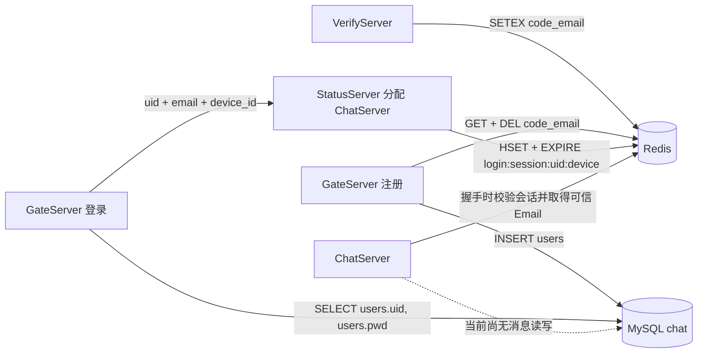

# 当前 Redis 与 MySQL 存储结构

> 更新时间：2026-08-15  
> 范围：`VerifyServer`、`GateServer`、`StatusServer`、`ChatServer` 当前源码  
> 说明：本文只记录代码中已经存在的存储结构；规划但尚未实现的聊天存储会单独标注。

## 1. 总览

```text
VerifyServer
  └─ Redis：写入邮箱验证码

GateServer
  ├─ Redis：消费验证码
  └─ MySQL：注册用户、查询 uid 与密码哈希

StatusServer
  └─ Redis：分配 ChatServer 后创建设备级登录会话

ChatServer
  ├─ RedisMgr：已具备设备级会话校验接口，尚未接入 WebSocket 鉴权
  └─ MysqlMgr：已复制进项目，尚未被业务调用
```

当前真正投入业务使用的存储只有：

- Redis 邮箱验证码。
- Redis 设备级登录会话。
- MySQL `users` 表中的注册与登录数据。

当前尚未实现：

- 聊天消息。
- 单聊或群聊会话。
- 好友关系。
- 群组和群成员。
- 用户在线路由。
- 消息送达水位。
- 消息已读水位。
- 离线消息拉取。
- 文件、图片和视频元数据。

## 2. Redis 当前实际结构

### 2.1 邮箱验证码

验证码由 `VerifyServer` 创建。

| 属性 | 当前值 |
|---|---|
| Redis 类型 | String |
| Key 格式 | `code_<email>` |
| Value | 4 位验证码 |
| TTL | 默认 180 秒 |
| 写入者 | VerifyServer |
| 消费者 | GateServer 注册接口 |

示例：

```text
Key:   code_user@example.com
Value: a3f2
TTL:   180 秒
```

VerifyServer 使用的等价 Redis 命令：

```redis
SETEX code_<email> 180 <code>
```

实现位置：

- `server/VerifyServer/server.js`
- `server/VerifyServer/redis.js`
- `server/VerifyServer/const.js`

如果 Key 已经存在，再次请求验证码时会复用原验证码，不会重新写入，因此不会刷新原 TTL。

#### 验证码消费

GateServer 注册时构造：

```cpp
const std::string redisKey =
    "code_" + email;
```

随后通过 Lua 脚本原子完成校验和删除：

```lua
local storedCode = redis.call("GET", KEYS[1])

if not storedCode then
    return 0
end

if storedCode ~= ARGV[1] then
    return -1
end

redis.call("DEL", KEYS[1])

return 1
```

| Lua 返回值 | C++ 结果 | 含义 | Key 是否删除 |
|---:|---|---|---|
| `1` | `Success` | 验证码正确 | 删除 |
| `0` | `CodeMissing` | 不存在、已过期或已使用 | 无 Key |
| `-1` | `CodeMismatch` | 验证码错误 | 保留 |
| 其他/Redis 异常 | `RedisError` | Redis 服务错误 | 不确定 |

因此验证码只能成功消费一次。

实现位置：

- `server/GateServer/Work/WorkHandler/RegisterHandler.cpp`
- `server/GateServer/Work/Redis/RedisMgr.cpp`

### 2.2 设备级登录会话

GateServer 验证密码后，将 MySQL 中可信的 `uid`、`email` 和客户端持久化的 `device_id` 交给 StatusServer。StatusServer 先分配 ChatServer，再生成 token 并创建 Redis 会话。

| 属性 | 当前值 |
|---|---|
| Redis 类型 | Hash |
| Key 格式 | `login:session:<uid>:<device_id>` |
| Hash 字段 | `uid`、`token`、`email`、`server_id`、`device_id` |
| TTL | 配置决定；当前配置为 3600 秒 |
| TTL 回退值 | 1800 秒 |
| 写入者 | StatusServer |
| 验证者 | ChatServer 的 `VerifyLoginSession()` |

示例：

```text
Key: login:session:42:10001

Hash:
  uid       = 42
  token     = <64 个十六进制字符>
  email     = user@example.com
  server_id = ChatServer1
  device_id = 10001

TTL: 3600 秒（设置在整个 Key 上）
```

token 生成方式：

```text
OpenSSL RAND_bytes 生成 32 字节安全随机数据
    ↓
每个字节转换为两个十六进制字符
    ↓
得到 64 字符 token
```

等价 Redis 操作：

```redis
HSET login:session:<uid>:<device_id> \
    uid <uid> \
    token <token> \
    email <email> \
    server_id <server_id> \
    device_id <device_id>
EXPIRE login:session:<uid>:<device_id> <ttl>
```

代码使用一个 Lua 脚本原子执行 `HSET` 和 `EXPIRE`，不会出现 Hash 已写入但忘记设置 TTL 的半完成状态。

当前会话语义是：

> 一个用户的每台设备分别拥有一个会话；同一设备重新登录会覆盖自己的旧 token，不会挤掉其他设备。

ChatServer 校验时同时比较 `uid`、`device_id`、`token` 和 `server_id`，匹配后才返回 Hash 中由登录链写入的可信 `email`。因此客户端不能通过 WebSocket 请求头伪造 Connection 中绑定的 Email，分配给 `ChatServer1` 的 token 也不能直接用于冒充 `ChatServer2` 会话。

实现位置：

- `server/GateServer/Work/WorkHandler/LoginHandler.cpp`
- `server/GateServer/Work/Grpc/StatusGrpcClient.cpp`
- `server/StatusServer/StatusServiceImpl.cpp`
- `server/StatusServer/RedisMgr.cpp`
- `server/ChatServer/redis/RedisMgr.cpp`

### 2.3 会话校验

校验接口：

```cpp
std::optional<LoginSessionInfo> RedisMgr::VerifyLoginSession(
    std::uint64_t uid,
    std::uint64_t deviceId,
    const std::string& token,
    const std::string& serverId)
{
    // 对 login:session:<uid>:<device_id> 执行 HMGET，
    // 四个安全字段全部相等后，返回包含可信 Email 的会话信息。
}
```

校验不会刷新 TTL。旧格式 `login:token:<email>` 已不再由新登录流程写入；Redis 中若仍有旧 Key，会按原 TTL 自然过期。

### 2.4 已封装但尚未用于正式业务的 Redis 操作

三份 `RedisMgr` 中还封装了：

| 操作 | Redis 类型或用途 |
|---|---|
| `Get/Set` | String |
| `LPush/LPop` | List |
| `RPush/RPop` | List |
| `HSet/HGet` | Hash |
| `Del` | 删除 Key |
| `ExistsKey` | 判断 Key 是否存在 |

GateServer 的 `TestRedisMgr()` 中存在以下演示 Key：

```text
blogwebsite
bloginfo
lpushkey1
lpushkey2
```

但 `TestRedisMgr()` 没有在 `main()` 中调用，所以这些不是服务器正常运行时产生的业务结构。

### 2.5 Redis 当前尚未实现的结构

分布式 ChatServer 后续需要增加用户在线路由，例如：

```text
Key: chat:online:user:<user_id>
```

建议保存：

```json
{
  "server_id": "chat-server-1",
  "connection_id": "conn-abcd",
  "device_id": 30001,
  "session_id": "session-xyz"
}
```

并通过心跳刷新 TTL。但该结构目前尚未实现，不能算作当前存储。

## 3. MySQL 当前实际结构

### 3.1 数据库 Schema

当前配置使用：

```text
Schema: chat
```

仓库中没有正式的 MySQL 建表或迁移脚本，因此无法仅根据源码确认：

- 完整字段类型。
- 主键。
- 唯一索引。
- 外键。
- 默认值。
- 是否存在代码尚未使用的字段。

### 3.2 users 表

当前代码能够确认存在：

```text
users
```

能够确认的字段：

| 字段 | 当前用途 |
|---|---|
| `name` | 用户名；未填写时使用邮箱 |
| `email` | 登录账号和注册查重条件 |
| `pwd` | libsodium 生成的密码哈希字符串 |

当前无法从仓库确认：

- 是否存在 `id` 或 `user_id`。
- 每个字段的真实 SQL 类型。
- `email` 是否已经创建唯一索引。
- 是否有创建时间或更新时间。

### 3.3 注册前查重

```sql
SELECT 1
FROM users
WHERE email = ?
LIMIT 1;
```

用途：注册前检查邮箱是否已经存在。

实现位置：

```text
server/GateServer/Work/Mysql/MysqlDao.cpp
```

### 3.4 注册用户

```sql
INSERT INTO users(name, email, pwd)
VALUES (?, ?, ?);
```

`pwd` 不是明文密码。GateServer 使用 libsodium：

```text
PasswordHasher::HashPassword(password)
```

生成可直接存储的密码哈希字符串。

### 3.5 登录查询

```sql
SELECT pwd
FROM users
WHERE email = ?
LIMIT 1;
```

随后通过：

```cpp
PasswordHasher::VerifyPassword(
    password,
    passwordHash);
```

验证用户输入的密码。

### 3.6 当前没有的 users 操作

代码中没有正式业务使用的：

```sql
UPDATE users ...
DELETE FROM users ...
```

所以当前用户数据只支持：

- 注册。
- 按邮箱查重。
- 按邮箱查询密码哈希并登录。

尚未实现：

- 查询可信 `user_id`。
- 修改用户名。
- 修改密码。
- 注销用户。
- 用户资料。

### 3.7 ChatServer 中的 MySQL 现状

ChatServer 当前的：

```text
server/ChatServer/mysql/MysqlDao.cpp
server/ChatServer/mysql/MysqlMgr.cpp
```

与 GateServer 版本相同，目前只提供：

```cpp
RegisterUser();
GetPasswordHash();
```

没有 ChatServer Handler 调用这些接口，也没有聊天消息存储接口。

尚未实现：

```cpp
SaveMessage();
FindMessageByClientId();
AllocateConversationSeq();
LoadMessagesAfterSeq();
UpdateDeliveredSeq();
UpdateReadSeq();
```

## 4. 当前真实数据流



## 5. 当前问题汇总

### P0：WebSocket 鉴权仍缺少传输加密和超时

ChatServer 已在 HTTP Upgrade 阶段调用 `VerifyLoginSession()`，校验通过后绑定可信用户信息：

```cpp
AuthSession{
    .uid = ...,
    .device_id = ...,
    .email = ...
};
```

当前仍使用明文 `ws://`，正式环境需要升级为 `wss://`；握手阶段还应增加读取和鉴权超时，避免未完成握手的连接长期占用资源。

### P1：没有数据库迁移脚本

仓库无法独立重建当前数据库。需要增加：

```text
server/ChatServer/sql/
```

并从第一份正式迁移开始维护表结构。

### P1：ChatServer 复制了不属于它的用户注册接口

ChatServer 当前复制的是 GateServer 的用户 DAO。后续应把业务改为消息相关接口，而不是继续调用：

```cpp
RegisterUser();
GetPasswordHash();
```

## 6. 后续需要增加的 MySQL 表

聊天最小闭环至少需要：

```text
conversations
conversation_members
messages
user_conversation_state
```

它们分别负责：

| 表 | 职责 |
|---|---|
| `conversations` | 单聊或群聊会话以及下一个会话序号 |
| `conversation_members` | 会话成员和成员权限 |
| `messages` | 消息正文、幂等 ID 和会话顺序 |
| `user_conversation_state` | 每位用户的送达与已读水位 |

这些属于下一阶段设计，当前数据库代码中还不存在。

## 7. 结论

当前真实存储能力可以概括为：

```text
Redis
├─ code_<email>                邮箱验证码，一次性消费
└─ login:session:<uid>:<device_id>
   ├─ uid
   ├─ token
   ├─ email
   ├─ server_id
   └─ device_id                整个 Hash 带 TTL

MySQL chat
└─ users
   ├─ name
   ├─ email
   └─ pwd                      libsodium 密码哈希
```

目前还没有任何聊天领域存储。接下来应把 `VerifyLoginSession()` 接入 ChatServer 的 WebSocket 鉴权，再建立消息、会话和用户会话水位表。
