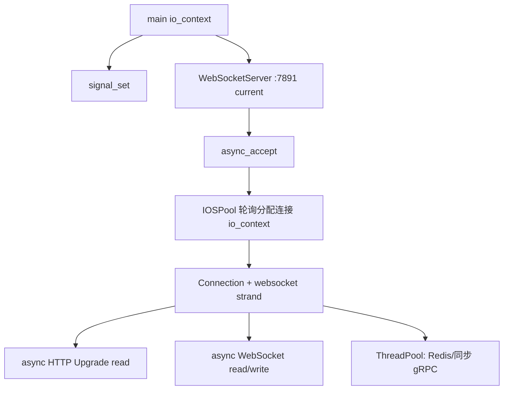
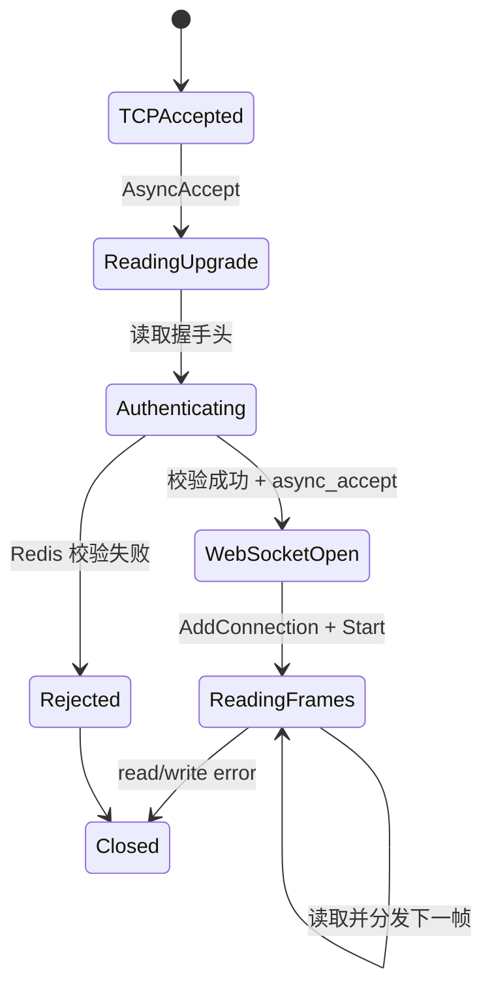
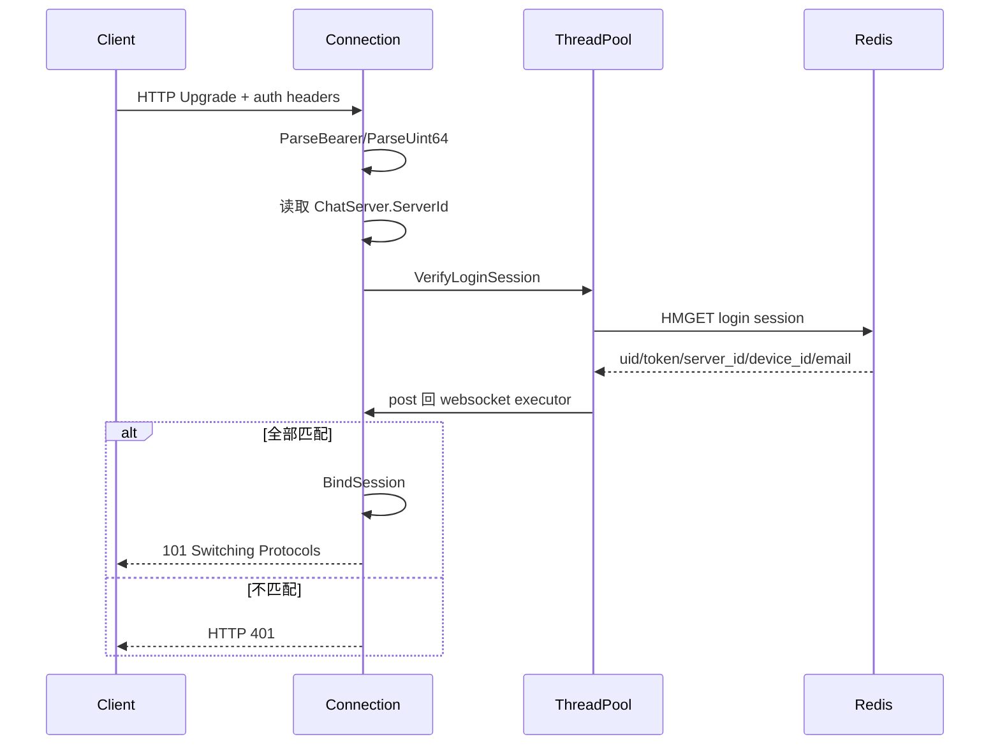
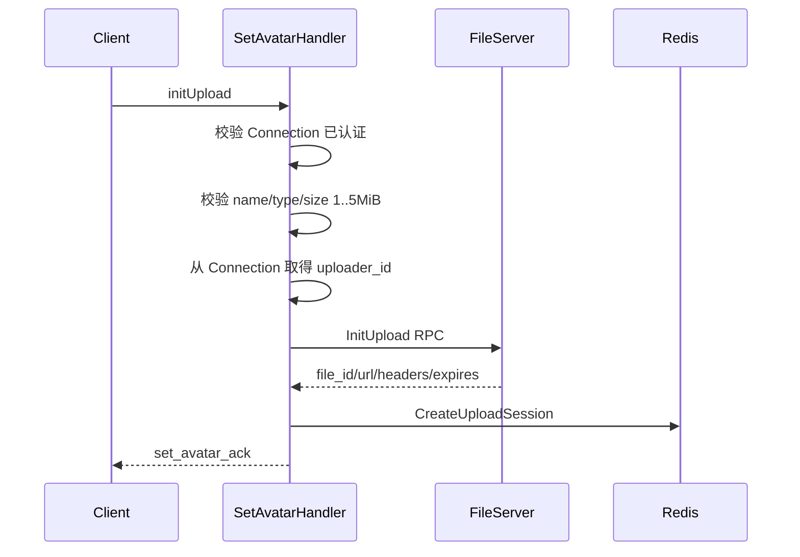

# ChatServer 架构与流程说明

> 源码快照：2026-09-02
> 模块目录：`server/ChatServer`
> 当前定位：WebSocket 长连接、登录会话鉴权和聊天业务路由服务。

项目级调用关系参见：[项目整体架构、服务流程与存储总览](../../docs/项目整体架构、服务流程与存储总览.md)。文件上传的跨服务约定参见：[文件上传架构与标识符约定](../../docs/文件上传架构与标识符约定.md)。

## 1. 职责边界

ChatServer 是用户登录后的主要业务入口，负责：

- 接受 WebSocket Upgrade；
- 使用 Redis 登录 Session 完成握手鉴权；
- 把可信 `uid/device_id/email` 绑定到 Connection；
- 管理长连接读写；
- 根据 `require` 分发业务消息；
- 调用 FileServer 编排头像/文件业务；
- 管理 Redis 上传会话；
- 后续负责用户搜索、单聊、资料更新和事件推送。

它不应接收大文件二进制，也不应让客户端决定可信 `uploader_id` 或 MinIO 对象键。

## 2. 主要目录

```text
ChatServer/
├─ main.cpp
├─ ConfigMgr.cpp/.h
├─ IOSPool.cpp/.h
├─ ThreadPool.h
├─ ioLoop/
│  ├─ WebSocketServer.cpp/.h
│  ├─ Connection.cpp/.h
│  └─ ConnectionMgr.cpp/.h
├─ route/LogicRoute.cpp/.h
├─ handler/
│  ├─ RequestHandler.cpp/.h
│  ├─ soloChatHandler.cpp/.h
│  ├─ SearchHandler.cpp/.h
│  └─ SetAvatarHandler.cpp/.h
├─ grpc/
│  ├─ FileGrpcClient.cpp/.h
│  └─ RpcPool.h
├─ redis/
│  ├─ RedisMgr.cpp/.h
│  └─ RedisFileMgr.cpp/.h
├─ mysql/
│  ├─ MysqlDao.cpp/.h
│  └─ MysqlMgr.cpp/.h
└─ proto/server.proto
```

## 3. 启动和线程模型



当前 `main.cpp`：

```cpp
unsigned int port = 7891;
```

因此 `ChatServer.ini [ChatServer].Port` 目前不会控制监听端口。这是配置一致性的优先修复项。

线程职责：

- 主 `io_context`：acceptor 和信号；
- `IOSPool`：每条连接分配一个 io_context 线程；
- WebSocket strand/executor：串行化同一连接的网络状态；
- `ThreadPool`：Redis、同步 gRPC 等阻塞操作；
- 工作线程完成后必须 `post` 回 Connection executor 再操作 WebSocket。

## 4. Connection 生命周期



每条 `Connection` 构造时生成随机 UUID：

```text
Connection::session_id_
```

它只是 ChatServer 内部连接 ID，不是登录 Session ID，也不是文件上传 Session ID。

## 5. WebSocket 握手鉴权

客户端必须携带：

```http
Authorization: Bearer <token>
X-User-Id: <uid>
X-Device-Id: <device_id>
```

服务端流程：



校验 Key：

```text
login:session:<uid>:<device_id>
```

必须同时匹配：

- `uid`；
- `token`；
- `server_id`；
- `device_id`；
- 并读取 `email` 绑定到连接。

鉴权任务必须持有 `shared_ptr<Connection>`。在 WebSocket Upgrade 和加入 `ConnectionMgr` 之前，如果只捕获 `weak_ptr`，HTTP read 回调结束后对象可能析构，客户端会看到 `socket hang up`。

## 6. ConnectionMgr

当前索引：

```text
connection_session_id -> shared_ptr<Connection>
```

当前没有：

```text
uid -> device_id -> Connection
```

所以还不能直接实现：

- 给指定用户推送消息；
- 同一用户多设备广播；
- 新登录踢掉旧连接；
- 统计单个用户在线设备。

后续应增加用户/设备索引，并保证添加和删除两个索引的一致性。

## 7. WebSocket 读写

读取流程：

```text
Connection::Start
  -> async_read
  -> buffers_to_string
  -> 清空 recv_buff_
  -> LogicRoute::HandlerPost
  -> 再次 Start
```

写入流程：

```text
SendResponse
  -> post 到 websocket executor
  -> push send_queue_
  -> 队列原来为空则 AsyncWrite
  -> 一个 async_write 完成后 pop
  -> 继续写下一条
```

同一个 Beast WebSocket stream 不能同时发起多个 write。`send_queue_` 保证严格串行写入。

## 8. 消息路由

请求顶层格式：

```json
{
  "version": 1,
  "require": "setAvatar",
  "action": "initUpload",
  "request_id": "avatar-request-001",
  "data": {}
}
```

`LogicRoute`：

1. 解析 JSON；
2. 确认根节点为对象；
3. 读取字符串 `require`；
4. 查找 Handler；
5. 调用 Handler；
6. 失败时尝试分发 `error` Handler。

当前注册：

| `require` | Handler | 状态 |
|---|---|---|
| `soloChat` | `soloChatHandler` | 未实现业务 |
| `searchUser` | `SearchHandler` | 参数校验后线程任务为空 |
| `setAvatar` | `SetAvatarHandler` | `initUpload` 已实现 |

当前并没有注册名为 `error` 的 Handler，因此 `dispatch_error` 找不到目标时不会向客户端发送结构化错误。这是路由层缺口。

## 9. 头像 InitUpload

请求：

```json
{
  "version": 1,
  "require": "setAvatar",
  "action": "initUpload",
  "request_id": "avatar-request-003",
  "data": {
    "client_file_id": "client-generated-id",
    "size_bytes": 358263,
    "content_type": "image/png",
    "file_name": "avatar.png"
  }
}
```

流程：



重要可信边界：

```cpp
const std::uint64_t uploaderId = connection->GetUserId();
```

`uploader_id` 不能从 WebSocket JSON 中读取。

当前第一版：

```text
session_id = fileResponse.file_id
object_key = fileResponse.file_id
```

## 10. Redis 上传会话

Key：

```text
upload:session:{<session_id>}
```

Hash 字段：

```text
session_id
object_key
client_file_id
uploader_id
conversation_id
original_file_name
expected_content_type
expected_size_bytes
expected_sha256
purpose
upload_mode
status
expires_at_ms
created_at_ms
```

当前实现：

| 接口 | 状态 |
|---|---|
| `CreateUploadSession` | 已实现，Lua 原子创建 + TTL |
| `GetUploadSession` | 已实现，严格解析 14 个字段 |
| `MarkUploadReady` | 只有声明 |
| `MarkUploadFailed` | 只有声明 |

状态机目标：

```text
pending -> ready
pending -> failed
```

状态转换必须用 Lua 比较当前状态后原子写入，以支持并发安全和重复 Complete 幂等。

## 11. FileServer gRPC 客户端

当前只有：

```text
FileGrpcClient::InitUpload
```

特点：

- 每次 RPC 创建独立 `ClientContext`；
- deadline 为 2 秒；
- 通过 `RpcPoolGuard` 借 Stub；
- transport status 和 FileServer `FileResult` 分层处理；
- 同步 RPC 必须在业务线程池调用。

仍需增加：

- `CompleteUpload`；
- `GetDownloadUrl`。

## 12. MySQL 现状

ChatServer 编译了 MySQL Pool、Dao 和 Mgr，但当前业务没有真正接入。

```cpp
Json::Value MysqlMgr::GetUserInfo(std::uint64_t uid)
{
    return Json::Value();
}
```

头像完成后需要增加：

```sql
UPDATE users
SET avatar_file_id = ?
WHERE uid = ?;
```

更完整的设计还应加入资料版本号并使用条件更新，防止并发上传完成顺序导致旧头像覆盖新头像。

## 13. 配置要求

```ini
[ChatServer]
ServerId=ChatServer1
Host=127.0.0.1
Port=7891

[RedisServer]
Host=127.0.0.1
Port=6379
password=
size=10

[FileServer]
Host=127.0.0.1
Port=50053
PoolSize=4
UploadSessionTTL=3600
```

`ServerId` 必须与 StatusServer 写入登录 Session 的值完全一致。

## 14. 当前完成度

| 能力 | 状态 |
|---|---|
| TCP/WebSocket 服务端 | 已实现 |
| 握手 Redis 鉴权 | 已实现 |
| 串行写队列 | 已实现 |
| JSON 路由框架 | 已实现 |
| 头像 InitUpload | 已实现 |
| 上传 Session Create/Get | 已实现 |
| 头像 CompleteUpload | 未实现 |
| 用户搜索 | 部分实现 |
| 单聊 | 未实现 |
| uid/device 连接索引 | 未实现 |
| 心跳/空闲超时 | 未实现 |
| MySQL 用户资料 | 未实现 |

## 15. 下一步顺序

1. 监听端口改为读取配置；
2. 完成 FileServer `CompleteUpload` 后增加 FileGrpcClient 接口；
3. 实现 Redis `MarkUploadReady/Failed`；
4. `SetAvatarHandler` 支持 `action=completeUpload`；
5. 成功后更新 `users.avatar_file_id`；
6. 建立 uid/device 连接索引；
7. 再实现单聊和用户搜索；
8. 增加心跳、重连和断线清理。

## 16. 调试检查表

- [ ] ChatServer 实际监听端口是否与 StatusServer 返回值一致；
- [ ] 握手 Header 名称是否没有多余引号和空格；
- [ ] Bearer token 是否仍在 Redis TTL 内；
- [ ] Redis Session 的 `server_id` 是否与本实例一致；
- [ ] 阻塞操作是否投递到了 ThreadPool；
- [ ] WebSocket 操作是否回到 Connection executor；
- [ ] 同一连接是否始终只有一个异步写；
- [ ] 日志是否避免输出完整 token 和预签名 URL。
