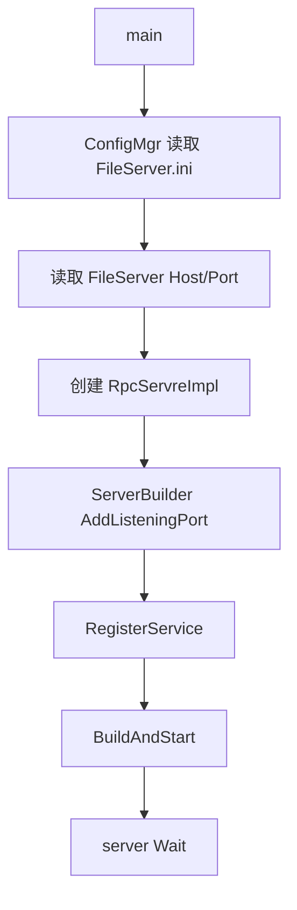
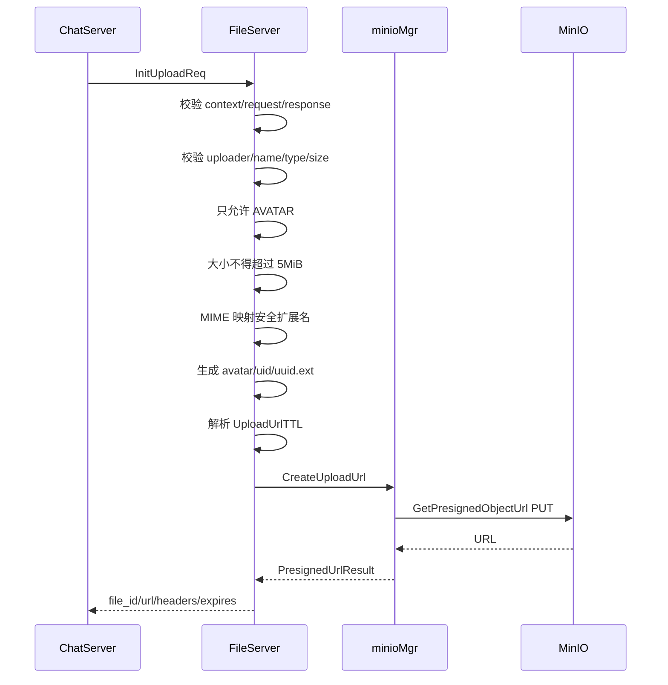
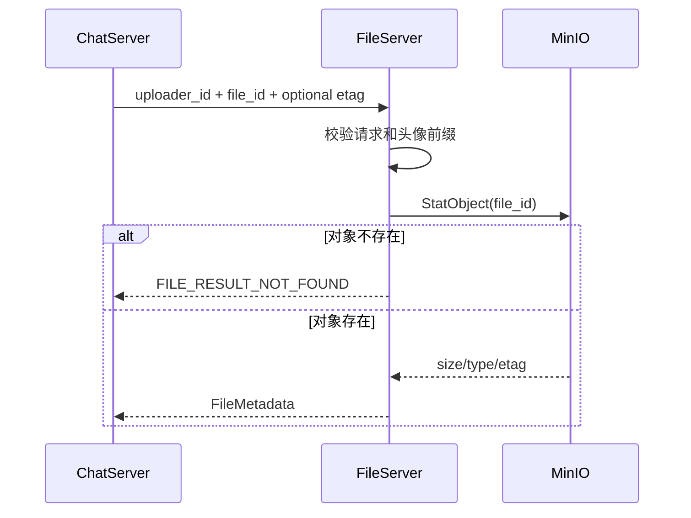

# FileServer 架构与流程说明

> 源码快照：2026-09-02
> 模块目录：`server/FileServer`
> 当前定位：MinIO 文件控制面 gRPC 服务。
> 工作区状态：`CompleteUpload` 正在开发，当前函数体尚未形成可编译实现。

项目级调用关系参见：[项目整体架构、服务流程与存储总览](../../docs/项目整体架构、服务流程与存储总览.md)。文件上传的跨服务约定参见：[文件上传架构与标识符约定](../../docs/文件上传架构与标识符约定.md)。

## 1. 职责边界

FileServer 负责：

- 接收可信后端服务的文件控制请求；
- 按文件用途校验大小和 MIME；
- 生成不包含用户文件名的对象键；
- 签发短期 MinIO PUT/GET URL；
- 使用 StatObject 查询对象实际大小、类型和 ETag；
- 把 MinIO SDK 类型转换成项目自己的结果结构。

FileServer 不负责：

- 接收或转发文件二进制；
- WebSocket 用户鉴权；
- 管理 Redis 上传会话；
- 更新 MySQL 用户资料；
- 判断聊天会话成员关系。

这些业务由 ChatServer 编排。

## 2. 主要目录

```text
FileServer/
├─ main.cpp
├─ ConfigMgr.cpp/.h
├─ grpc/
│  └─ RpcServre.cpp/.h
├─ minio/
│  └─ minioMgr.cpp/.h
├─ proto/
│  └─ server.proto
└─ generate/
   └─ server.pb.* / server.grpc.pb.*
```

`RpcServre` 是当前已有类名拼写，虽然应为 `RpcServer`，重命名需要同时处理项目文件和引用，不应在功能开发中随手改动。

## 3. 启动流程



当前使用同步 gRPC Server 和 insecure credentials。

配置查找顺序：

1. FileServer 可执行文件目录；
2. 当前工作目录。

## 4. gRPC 协议

`FileService` 定义三个 RPC：

| RPC | 用途 | 当前状态 |
|---|---|---|
| `InitUpload` | 生成对象键和预签名 PUT URL | 已实现 |
| `CompleteUpload` | 查询对象并确认上传完成 | 正在开发 |
| `GetDownloadUrl` | 返回短期 GET URL | 未实现业务 |

文件用途枚举已经定义：

```text
AVATAR
USER_BACKGROUND
CHAT_IMAGE
CHAT_VIDEO
CHAT_AUDIO
CHAT_FILE
```

当前只开放 `AVATAR`。

## 5. InitUpload 流程



允许的 MIME：

| MIME | 服务端扩展名 |
|---|---|
| `image/jpeg` | `.jpg` |
| `image/png` | `.png` |
| `image/webp` | `.webp` |

对象键：

```text
avatar/<uploader_id>/<server-generated-uuid>.<extension>
```

客户端 `file_name` 只作为显示信息，不参与路径生成，从而避免路径注入和重名覆盖。

## 6. file_id、object_key 与 uploader_id

当前 `InitUploadRsp.file_id` 直接返回完整对象键：

```text
file_id = object_key
```

示例：

```text
uploader_id = 3
file_id     = avatar/3/e1b0224f-2caa-4ccb-95bc-54939e750ad0.png
```

`file_id` 不对应或等于 `uploader_id`，只是路径中含有用户 ID。

对象归属的可靠判断需要 ChatServer 上传 Session：

```text
request.uploader_id == session.uploader_id
request.file_id      == session.object_key
```

FileServer 可再检查头像对象键前缀作为纵深防御，但不能只依赖前缀。

## 7. 预签名 PUT URL

`minioMgr::CreateUploadUrl` 构造：

```cpp
args.bucket = bucket_;
args.object = object_key;
args.method = minio::http::Method::kPut;
args.expiry_seconds = expires_seconds;
```

MinIO 根据 URL 签名确认：

- Bucket；
- 对象键；
- HTTP 方法；
- Host；
- 签发时间和到期时间；
- AccessKey 对应的签名。

修改对象路径、Bucket、方法、Host、有效期或签名会使请求失败。

当前 URL 中通常出现：

```text
X-Amz-SignedHeaders=host
```

这表示 Content-Type、Content-Length 和文件内容没有纳入签名。客户端应按返回的 `upload_headers` 发送 `Content-Type`，但当前签名本身不强制它。

已经拿到 URL 的人可以在过期前反复 PUT 覆盖同一个对象，但不能把路径改成另一个对象后继续使用原签名。

## 8. MinIO 管理器

### CreateUploadUrl

- 为指定对象键生成 PUT URL；
- 返回拥有内存的 `std::string`；
- 配置不完整或 SDK 失败时返回错误结构。

### CreateDownloadUrl

- 为指定对象键生成 GET URL；
- MinIO 能力已实现，但 RPC 业务还没接入。

### StatObject

执行对象 HEAD/Stat：

```text
bucket + object_key
  -> status_code
  -> size_bytes
  -> etag
  -> content_type
  -> user_metadata
```

MinIO SDK 使用 Multimap 保存用户元数据，FileServer 转成：

```cpp
std::map<std::string, std::string>
```

这样 RPC 和业务层不依赖 SDK 私有容器类型。

## 9. CompleteUpload 目标流程



职责分工建议：

- ChatServer 读取 Redis Session，校验 `uploader_id/status/expiry`；
- FileServer 向 MinIO 查询对象实际信息；
- ChatServer 比较 Redis 预期值和 MinIO 实际值；
- ChatServer 用 Redis Lua 原子标记 ready/failed；
- ChatServer 更新 MySQL 业务记录。

当前 `CompleteUpload` 函数体含未完成表达式：

```cpp
request.
```

因此应先恢复编译，再继续端到端联调。

## 10. GetDownloadUrl 目标流程

1. ChatServer 先做业务访问权限判断；
2. FileServer 校验 `file_id` 基本格式；
3. FileServer 读取 `DownloadUrlTTL`；
4. 调用 `CreateDownloadUrl`；
5. 返回 `download_url/expires_at_ms`；
6. 客户端直接向 MinIO GET。

预签名下载 URL 不能写入 MySQL。MySQL 只保存稳定 `file_id/object_key`。

## 11. 配置要求

```ini
[FileServer]
Host=127.0.0.1
Port=50053

[Minio]
Endpoint=192.168.18.130:9100
AccessKey=...
SecretKey=...
Bucket=chat-files
Secure=false
UploadUrlTTL=600
DownloadUrlTTL=300
```

端口区分：

- `9100`：MinIO S3 API，预签名 URL 使用；
- `9101`：MinIO Console，人工管理使用。

AccessKey 和 SecretKey 不能提交 Git 或打印到日志。

## 12. 当前完成度

| 能力 | 状态 |
|---|---|
| gRPC 启动 | 已实现 |
| MinIO 配置 | 已实现 |
| 头像 InitUpload | 已实现 |
| 预签名 PUT | 已实现 |
| StatObject | 已实现 |
| 预签名 GET 底层方法 | 已实现 |
| CompleteUpload RPC | 未完成，当前阻塞编译 |
| GetDownloadUrl RPC | 未实现业务 |
| 文件元数据持久化 | 不属于 FileServer 第一版职责 |

## 13. 下一步顺序

1. 完成 `CompleteUpload` 基础参数校验；
2. 校验头像对象键归属前缀；
3. 接入 `StatObject` 并映射 404/内部错误；
4. 返回完整 `FileMetadata`；
5. 增加 GetDownloadUrl；
6. 增加 RPC 单元测试和真实 MinIO 集成测试；
7. 最后再扩展聊天图片、大文件和 Multipart。

## 14. 调试检查表

- [ ] FileServer 是否读取正确的 `FileServer.ini`；
- [ ] Endpoint 是否为客户端能访问的 MinIO API 地址；
- [ ] Bucket `chat-files` 是否存在；
- [ ] URL 中 Host 是否与实际上传请求 Host 一致；
- [ ] PUT 是否使用 URL 返回时要求的 Header；
- [ ] StatObject 查询的对象键是否与 Redis Session 一致；
- [ ] 日志是否避免打印完整预签名 URL和 SecretKey。
