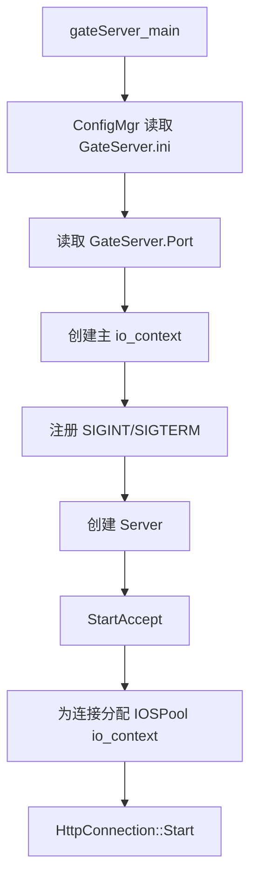
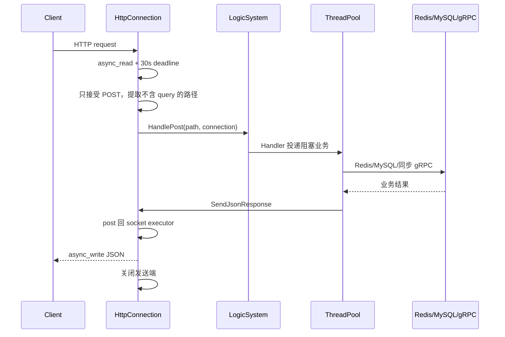
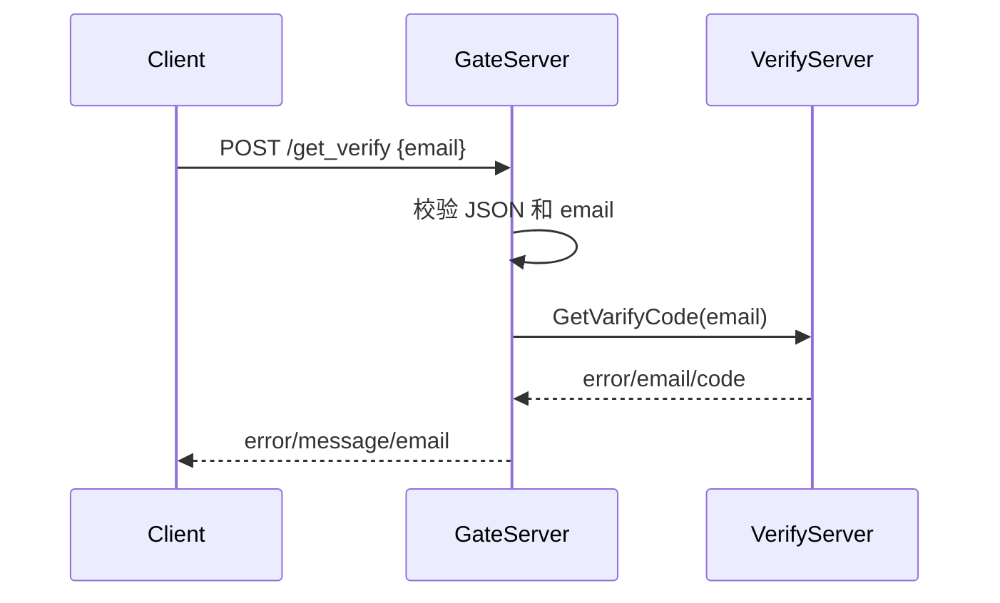
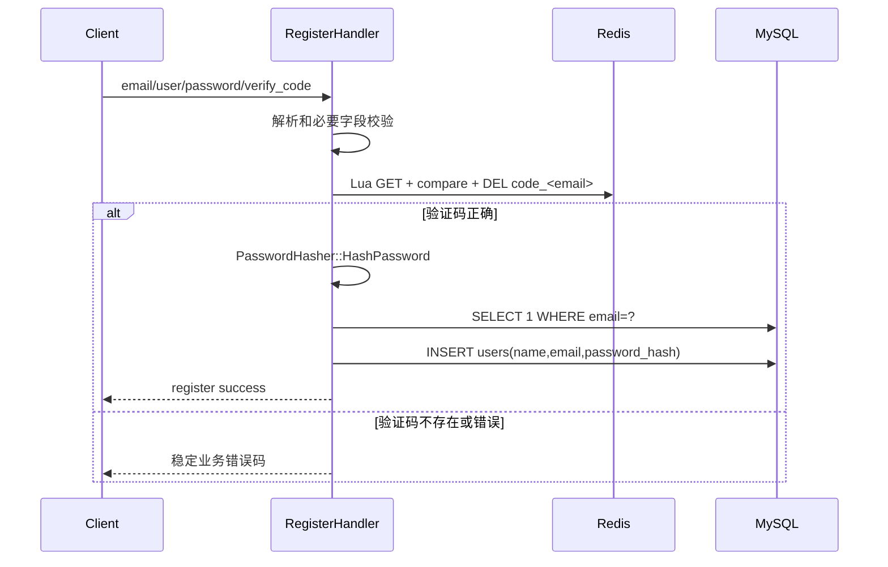
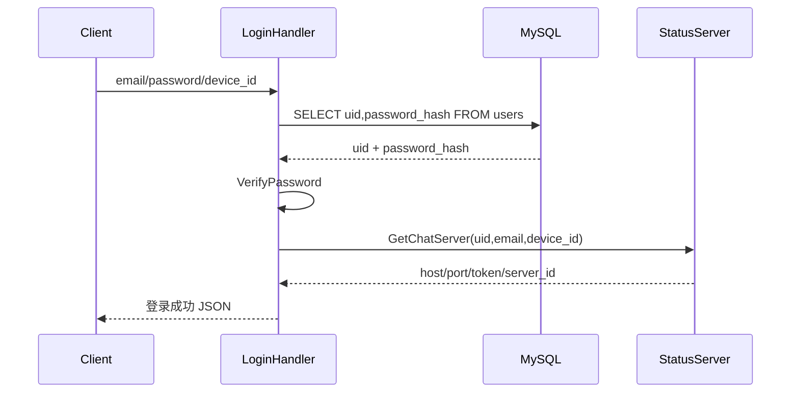

# GateServer 架构与流程说明

> 源码快照：2026-09-02
> 模块目录：`server/GateServer`
> 当前定位：客户端 HTTP 网关、账号注册登录入口、内部 gRPC 编排服务。

项目级调用关系参见：[项目整体架构、服务流程与存储总览](../../../docs/项目整体架构、服务流程与存储总览.md)。

## 1. 职责边界

GateServer 是客户端进入后端系统的第一层服务，当前负责：

- 对 Qt Client 暴露 HTTP/JSON 接口；
- 转发邮箱验证码请求到 VerifyServer；
- 使用 Redis 原子消费注册验证码；
- 使用 MySQL 注册用户、查询登录信息；
- 使用 libsodium 生成和校验密码哈希；
- 登录成功后调用 StatusServer 分配 ChatServer；
- 把 `uid/device_id/token/server_id/host/port` 返回客户端。

GateServer 不负责：

- WebSocket 长连接；
- 聊天消息投递；
- 文件二进制上传；
- MinIO 对象管理；
- 登录 token 的生成和最终校验。

登录 token 由 StatusServer 生成，最终在 ChatServer 握手阶段通过 Redis 校验。

## 2. 主要目录

```text
GateServer/
├─ gateServer_main.cpp
├─ ConfigMgr.cpp/.h
├─ IoLoop/
│  ├─ Server.cpp/.h
│  ├─ HttpConnection.cpp/.h
│  └─ IOSPool.cpp/.h
└─ Work/
   ├─ WorkRoute/LogicSystem.cpp/.h
   ├─ WorkHandler/
   │  ├─ VarifyHandler.cpp/.h
   │  ├─ RegisterHandler.cpp/.h
   │  ├─ LoginHandler.cpp/.h
   │  ├─ ResetHandler.cpp/.h
   │  └─ PasswordHasher.cpp/.h
   ├─ Grpc/
   │  ├─ VerifyGrpcClient.cpp/.h
   │  ├─ StatusGrpcClient.cpp/.h
   │  └─ RpcPool.h
   ├─ Redis/RedisMgr.cpp/.h
   ├─ Mysql/MysqlDao.cpp/.h
   └─ ThreadPool.h
```

## 3. 启动流程



配置查找顺序：

1. `GateServer.exe` 所在目录的 `GateServer.ini`；
2. 当前工作目录的 `GateServer.ini`。

联合启动时应以 EXE 目录中的配置为准。

## 4. HTTP 请求处理流程



关键线程规则：

- Asio I/O 线程只处理网络读写和路由；
- MySQL、Redis、同步 gRPC 放到业务线程池；
- Handler 不能从工作线程直接修改 socket 和 `response_`；
- `SendJsonResponse` 会把响应操作投递回 socket executor；
- `response_started_` 用原子变量防止同一请求发送两次响应。

当前 HTTP 特性：

- 只支持 POST；
- 未知路由返回 404；
- 非 POST 返回 405；
- 请求读取超时 30 秒；
- 当前是短连接，不支持 keep-alive 复用。

## 5. 路由表

| 路径 | Handler | 状态 | 下游依赖 |
|---|---|---|---|
| `POST /get_verify` | `VarifyHandler` | 已实现 | VerifyServer gRPC |
| `POST /register` | `RegisterHandler` | 已实现 | Redis、MySQL |
| `POST /login` | `LoginHandler` | 已实现 | MySQL、StatusServer gRPC |
| `POST /reset` | `ResetHandler` | 未实现 | 函数体为空 |

## 6. 获取验证码流程



GateServer 当前不会把 VerifyServer 返回的验证码 `code` 转发给客户端。

风险：`VerifyGrpcClient::GetVerify` 当前没有设置 deadline。VerifyServer 卡住时，会长期占用 GateServer 业务线程。

## 7. 注册流程



兼容字段：

- 新密码字段：`password`；旧字段：`passwd`；
- 新验证码字段：`verify_code`；旧字段：`varifycode`。

Lua 原子消费验证码可以防止同一验证码被并发重复使用。

当前取舍：验证码在写 MySQL 之前就被删除。如果 MySQL 临时失败，用户必须重新获取验证码。

## 8. 登录流程



`device_id` 支持十进制字符串或 JSON UInt64。客户端使用字符串可以避免 JSON Number 对 64 位整数的精度问题。

成功响应的关键字段：

```json
{
  "uid": "3",
  "device_id": "10001",
  "email": "user@example.com",
  "token": "64-char-hex-token",
  "server_id": "ChatServer1",
  "host": "127.0.0.1",
  "port": "7891"
}
```

`StatusGrpcClient` 有 2 秒 deadline。

## 9. MySQL 使用

GateServer 当前实际执行的 SQL：

```sql
SELECT 1 FROM users WHERE email = ? LIMIT 1;

INSERT INTO users(name, email, password_hash)
VALUES (?, ?, ?);

SELECT uid, password_hash
FROM users
WHERE email = ?
LIMIT 1;
```

MySQL 连接池特性：

- 启动时按配置创建连接；
- 借用连接最多等待 3 秒；
- 后台线程每 60 秒检查；
- 空闲至少 5 秒的连接执行 `SELECT 1`；
- 失效连接会重建；
- 使用 RAII Guard 自动归还连接。

当前登录 SQL 没有读取 `users.status`。即使用户被设置为停用，仍可能成功登录。

## 10. Redis 使用

GateServer 注册阶段访问：

```text
code_<email>
```

Redis Lua 返回约定：

| 返回值 | 业务结果 |
|---|---|
| `1` | 验证码正确，已经删除 |
| `0` | Key 不存在或验证码过期 |
| `-1` | 验证码不匹配 |

登录 Session 不是 GateServer 创建的，而是 StatusServer 创建、ChatServer 校验。

## 11. gRPC Stub 池

GateServer 为 VerifyService 和 StatusService 分别维护 `RpcPool`：

- 池中的多个 Stub 共享同一个 gRPC Channel；
- PoolSize 限制同时借出的 Stub 数；
- `RpcPoolGuard` 负责借出和自动归还；
- 池空时 `Borrow` 会等待；
- 这不是“每个 Stub 一条独立 TCP 连接”的传统连接池。

## 12. 配置要求

`GateServer.ini` 至少应包含：

```ini
[GateServer]
Port=9999

[VarifyServer]
Host=127.0.0.1
Port=50051
PoolSize=5

[StatusServer]
Host=127.0.0.1
Port=50052
PoolSize=5

[RedisServer]
Host=127.0.0.1
Port=6379
password=
size=5

[Mysql]
Host=127.0.0.1
Port=3306
PoolSize=5
User=...
Password=...
Schema=chat
```

当前 `GateServer.ini.example` 缺少 `[StatusServer]`，需要修正模板。

## 13. 当前完成度与下一步

| 能力 | 状态 |
|---|---|
| HTTP 网络层 | 已实现 |
| 验证码转发 | 已实现 |
| 注册 | 已实现 |
| 登录 | 已实现 |
| 密码重置 | 未实现 |
| 请求限流 | 未实现 |
| 登录检查账号状态 | 未实现 |
| Verify RPC deadline | 未实现 |

建议顺序：

1. 补全 `GateServer.ini.example`；
2. 给 Verify RPC 增加 deadline；
3. 登录查询加入 `status`；
4. 完成安全的密码重置流程；
5. 增加验证码、注册和登录限流；
6. 增加 Handler 级单元测试和 HTTP 端到端测试。

## 14. 调试检查表

- [ ] 控制台打印的 Loaded config 是否为 EXE 目录下 `GateServer.ini`；
- [ ] `[VarifyServer]` 和 `[StatusServer]` 是否完整；
- [ ] Redis、MySQL 连接池是否成功初始化；
- [ ] StatusServer 返回的 ChatServer 端口是否真实监听；
- [ ] 日志中是否避免输出密码、token 和数据库密码；
- [ ] HTTP 错误是否同时区分传输状态和 JSON 业务错误码。
