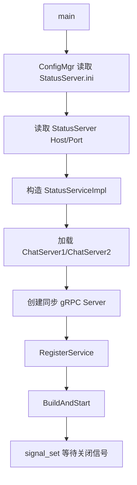
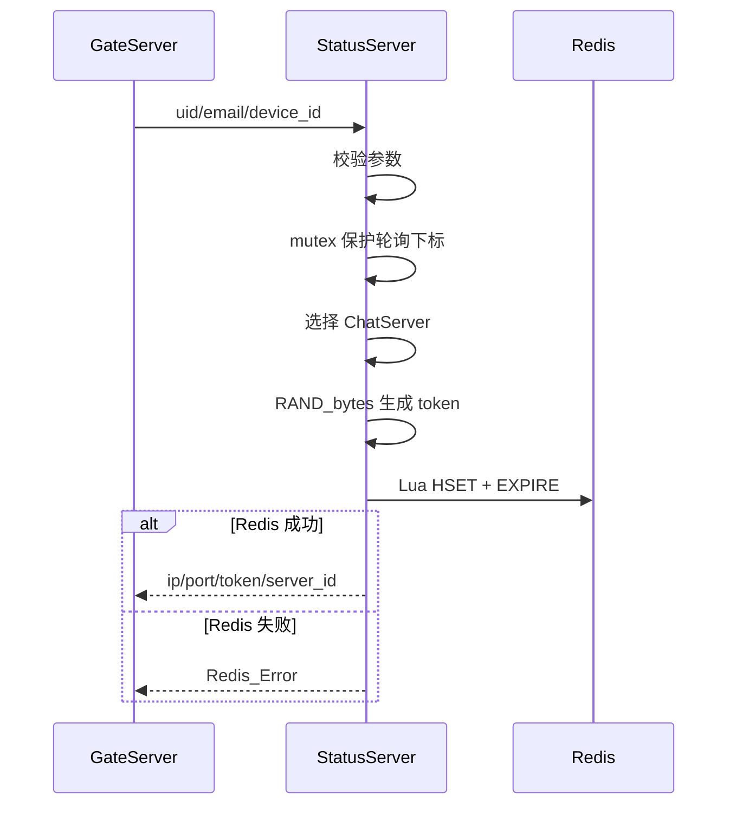

# StatusServer 架构与流程说明

> 源码快照：2026-09-02
> 模块目录：`server/StatusServer`
> 当前定位：ChatServer 分配器和登录会话签发服务。

项目级调用关系参见：[项目整体架构、服务流程与存储总览](../../../docs/项目整体架构、服务流程与存储总览.md)。

## 1. 职责边界

StatusServer 在用户通过 GateServer 密码校验后执行：

- 从配置的 ChatServer 列表中选择一个实例；
- 生成高强度随机登录 token；
- 把 token、用户、设备和目标 ChatServer 写入 Redis；
- 返回 ChatServer 地址和凭证。

它不校验用户密码，也不处理 WebSocket 和聊天消息。

## 2. 主要文件

```text
StatusServer/
├─ main.cpp
├─ ConfigMgr.cpp/.h
├─ StatusServiceImpl.cpp/.h
├─ RedisMgr.cpp/.h
├─ RpcPool.h
├─ const.h
└─ StatusServer.ini.example
```

## 3. 启动流程



服务使用 gRPC insecure credentials，适合当前本机/内网开发环境。

## 4. ChatServer 列表

构造函数当前固定调用：

```cpp
LoadChatServer("ChatServer1");
LoadChatServer("ChatServer2");
```

每个配置段需要：

```ini
[ChatServer1]
Host=127.0.0.1
Port=7891
```

无效或缺失的 Host/Port 会使该实例不加入 `_servers`。

当前没有动态服务注册、健康检查和服务发现。

## 5. GetChatServer 流程



轮询实现：

```text
selected = servers[index]
index = (index + 1) % servers.size
```

互斥锁只保护服务列表选择，不覆盖 Redis 操作。

## 6. Token 生成

```text
OpenSSL RAND_bytes
  -> 32 字节随机数
  -> HexEncode
  -> 64 字符十六进制 token
```

token 不应记录到普通日志。当前日志只打印 uid、device_id 和分配的 `server_id/host/port`。

## 7. Redis 登录会话

Key：

```text
login:session:<uid>:<device_id>
```

Type：Hash。

| 字段 | 含义 |
|---|---|
| `uid` | MySQL 用户主键 |
| `token` | 本次登录生成的随机凭证 |
| `email` | 登录邮箱 |
| `server_id` | 被分配的 ChatServer |
| `device_id` | 客户端设备标识 |

StatusServer 使用 Lua 原子执行：

```text
HSET key fields...
EXPIRE key ttl
```

这样不会出现 Hash 已经创建但忘记设置 TTL 的半成品状态。

同一用户、同一设备再次登录时，Key 相同，因此会覆盖旧 token 和旧 `server_id`。旧 WebSocket 凭证随即失效。

## 8. gRPC 错误边界

当前约定：

- request/reply 空指针属于框架异常，返回 gRPC INTERNAL；
- RPC 被取消返回 gRPC CANCELLED；
- 参数错误、无可用 ChatServer、Redis 失败通过响应中的 `error` 表达，同时 gRPC 返回 OK。

调用方必须同时检查：

1. gRPC Transport Status；
2. `GetChatServerRsp.error` 业务错误码。

## 9. 配置要求

```ini
[StatusServer]
Host=127.0.0.1
Port=50052

[RedisServer]
Host=127.0.0.1
Port=6379
password=
size=10
TTL=3600

[ChatServer1]
Host=127.0.0.1
Port=7891

[ChatServer2]
Host=127.0.0.1
Port=7892
```

当前示例中的 ChatServer 端口是 `9001/9002`，而 ChatServer 源码实际硬编码监听 `7891`。必须统一，否则登录成功后客户端会连接到没有服务的端口。

## 10. 当前完成度

| 能力 | 状态 |
|---|---|
| 同步 gRPC 服务 | 已实现 |
| 静态 ChatServer 加载 | 已实现，仅两个固定名称 |
| 轮询分配 | 已实现 |
| 安全 token 生成 | 已实现 |
| Redis Session 原子写入 | 已实现 |
| 动态服务注册 | 未实现 |
| 健康检查 | 未实现 |
| 负载感知 | 未实现 |
| token 刷新/注销/撤销 | 未实现 |

## 11. 后续演进顺序

1. 先统一 ChatServer 实际端口；
2. 增加 ChatServer 健康状态，避免分配离线实例；
3. 增加注销和 token 撤销；
4. 增加在线连接数等轻量负载指标；
5. 再考虑动态注册和服务发现；
6. 生产部署前增加 TLS 或受控服务网格。

## 12. 调试检查表

- [ ] Loaded config 是否为 `StatusServer.ini`；
- [ ] 至少加载到一个 ChatServer；
- [ ] ChatServer 配置端口是否真实监听；
- [ ] Redis Session TTL 是否大于 0；
- [ ] 登录后 `login:session:<uid>:<device_id>` 是否存在；
- [ ] Hash 中 `server_id` 是否与客户端连接目标一致。
