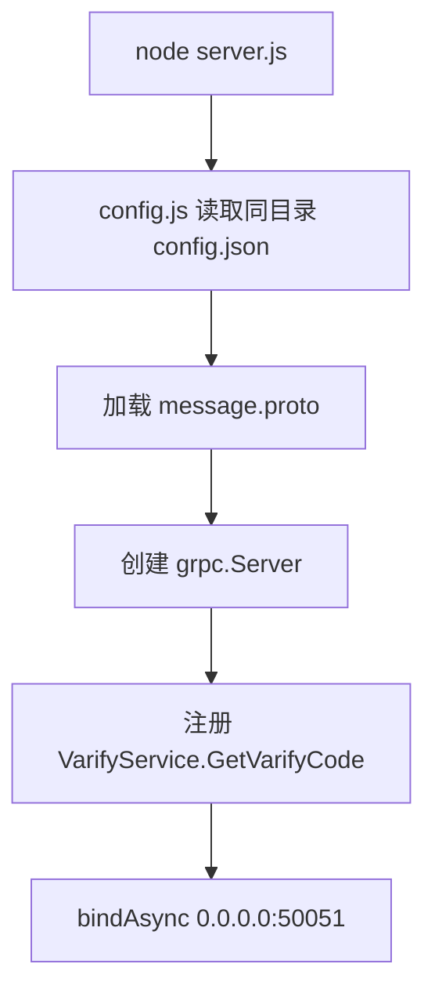
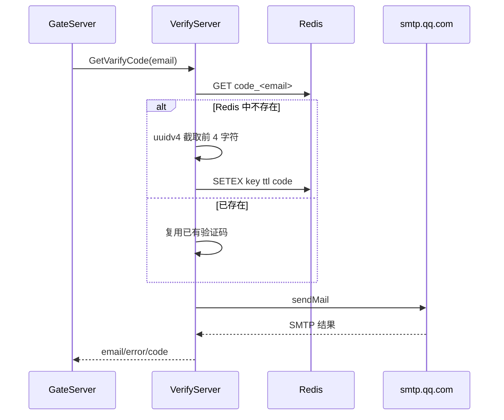

# VerifyServer 架构与流程说明

> 源码快照：2026-09-02
> 模块目录：`server/VerifyServer`
> 当前定位：Node.js 邮箱验证码 gRPC 服务。

项目级调用关系参见：[项目整体架构、服务流程与存储总览](../../docs/项目整体架构、服务流程与存储总览.md)。

## 1. 职责边界

VerifyServer 只负责验证码的生成、短期缓存和邮件发送：

- 接收 GateServer 的 gRPC 请求；
- 根据邮箱查找 Redis 中已有验证码；
- 必要时生成新验证码并设置 TTL；
- 使用 QQ SMTP 发送邮件；
- 返回发送结果。

它不负责注册用户、校验密码、生成登录 token 或访问聊天数据。

## 2. 主要文件

```text
VerifyServer/
├─ server.js          gRPC 服务入口和 GetVarifyCode
├─ proto.js           加载 proto
├─ redis.js           Redis 客户端
├─ email.js           nodemailer SMTP
├─ config.js          读取 config.json
├─ const.js           错误码和 Key 前缀
├─ config.example.json
└─ package.json
```

## 3. 启动流程



当前监听地址和端口硬编码为：

```text
0.0.0.0:50051
```

`config.json` 不能改变监听端口。

## 4. GetVarifyCode 流程



Redis Key：

```text
code_<email>
```

默认 TTL：

```text
config.redis.code_expire || 180 秒
```

同一邮箱在 TTL 内重复请求时，不会生成新验证码，而是重复发送已有验证码。

## 5. Redis 客户端

`redis.js` 维护一个模块级复用连接：

```text
GetClient
  -> BuildClient
  -> 必要时 AUTH
  -> WaitReady
  -> 返回共享 client
```

公开方法：

| 方法 | Redis 命令 | 用途 |
|---|---|---|
| `GetRedis` | `GET` | 查询现有验证码 |
| `SetRedisExpire` | `SETEX` | 原子写验证码和 TTL |
| `QuitRedis` | `QUIT` | 关闭连接，目前入口没有调用 |

重试总时长超过 3 秒会返回错误。

## 6. 邮件发送

`email.js` 使用 nodemailer：

```text
Host: smtp.qq.com
Port: 465
Secure: true
```

邮箱地址和授权码来自：

```json
{
  "email": {
    "user": "...",
    "pass": "..."
  }
}
```

配置文件中的授权码属于敏感信息，不应提交 Git，也不能打印到日志。

## 7. gRPC 协议

请求：

```proto
message GetVarifyReq {
  string email = 1;
}
```

响应：

```proto
message GetVarifyRsp {
  int32 error = 1;
  string email = 2;
  string code = 3;
}
```

当前响应包含验证码明文 `code`。GateServer 没有继续转发，但生产设计应删除该响应字段或始终返回空值，避免内部日志、代理或误调用泄漏验证码。

## 8. 配置结构

`config.example.json` 当前包含：

- `email`：SMTP 账号和授权码；
- `redis`：Host、Port、密码、验证码 TTL；
- `mysql`：当前服务代码没有使用。

MySQL 配置是历史遗留。应删除无用段，或者在文档中明确未来用途，避免误认为 VerifyServer 依赖 MySQL。

## 9. 当前风险

| 风险 | 影响 |
|---|---|
| 验证码只有 UUID 前四个字符 | 字符空间和用户体验不够标准 |
| gRPC 响应携带验证码 | 内部泄漏面扩大 |
| 没有邮箱/IP 频控 | 可被用于邮件轰炸和资源消耗 |
| 没有验证码错误次数限制 | 攻击者可在 TTL 内重复尝试 |
| 监听端口硬编码 | 配置和部署不灵活 |
| 没有输入邮箱格式校验 | 无效地址也会进入 SMTP 流程 |
| 没有优雅关闭 | 退出时不会主动释放 Redis/SMTP 资源 |

## 10. 建议下一步

1. 增加监听 Host/Port 配置；
2. 使用密码学安全的六位数字验证码；
3. 不在 gRPC 响应中返回验证码；
4. 使用 Redis Lua 增加邮箱/IP 申请频率限制；
5. 增加错误尝试次数 Key；
6. 增加 SIGINT/SIGTERM 优雅关闭；
7. 增加 Redis 故障、SMTP 故障和重复申请测试。

## 11. 调试检查表

- [ ] `config.json` 是否与 `server.js` 同目录；
- [ ] Redis 密码字段名是否为 `passwd`；
- [ ] QQ 邮箱使用的是授权码而不是登录密码；
- [ ] 50051 端口是否被占用；
- [ ] Redis 中是否出现 `code_<email>` 且 TTL 正常；
- [ ] GateServer 调用是否设置合理超时。
